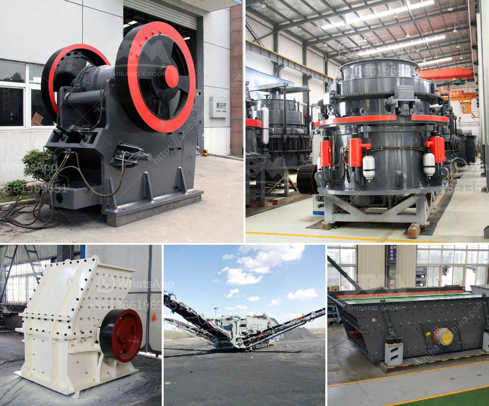

<h3>hammer crusher hammer balancing chart</h3>
The hammer crusher is a powerful machine that is used for crushing various materials. Hammer mills are used for grinding almost all types of free-flowing materials. Hammer mills operate on the principle that most materials will grind or crush upon impact with the hammers. The material is fed into a hammer mill from the top and gravity falls into the grinding chamber.

The hammer crusher hammer balancing chart is a mechanical principle of balancing the hammer crusher rotor according to the weight difference of each hammers head. It solves the problem of uneven distribution of the weight of each hammer by arranging them symmetrically.

The hammer crusher hammer balancing chart helps in improving the working stability and service life of hammers significantly. The chart provides a visual representation of the weight distribution of each hammer while balancing it. This allows for appropriate adjustments to be made, ensuring that each hammer has an equal impact force during the crushing process.

If the hammers of a hammer crusher are not balanced, the uneven distribution of weight can result in the hammer crusher vibrating or shaking during operation. This can cause excessive wear and tear on the hammer crusher components, leading to reduced efficiency and potentially costly repairs.

By using the hammer balancing chart, operators can quickly identify any imbalances in the hammer crusher system. They can then make the necessary adjustments, such as adding or removing weight from specific hammers to achieve balance. This ensures that the hammer crusher operates smoothly and efficiently, avoiding unnecessary downtime and maintenance.

Regularly checking and balancing the hammers in a hammer crusher is crucial for optimal performance. The hammer balancing chart serves as a useful tool for achieving and maintaining this balance, prolonging the lifespan of the machine and reducing maintenance costs.

In conclusion, the hammer crusher hammer balancing chart is an essential tool that can help operators ensure the proper functioning and longevity of their hammer crusher machines. By balancing the weight distribution of each hammer, the chart allows for adjustments to be made, preventing operational issues and optimizing the crushing process. Investing in proper hammer balancing can save time, money, and headaches down the line.
<h3>Contact us</h3><ul><li><strong>Whatsapp:&nbsp;<a href="https://wa.me/8613661969651">+8613661969651</a></strong></li><li><a href="https://swt.shibang-china.com/?git&amp;zhl&amp;hammer crusher hammer balancing chart"><strong>Online Service(chat now)</strong></a></li></ul><h3>Related</h3><ul><li><a href='calcium carbonate machine.md'>calcium carbonate machine</a></li><li><a href='dolomite grinding upmesh plant ih india.md'>dolomite grinding upmesh plant ih india</a></li><li><a href='ball mill grinder canada.md'>ball mill grinder canada</a></li><li><a href='material composition for coal screen.md'>material composition for coal screen</a></li><li><a href='manganese metal production process.md'>manganese metal production process</a></li></ul>