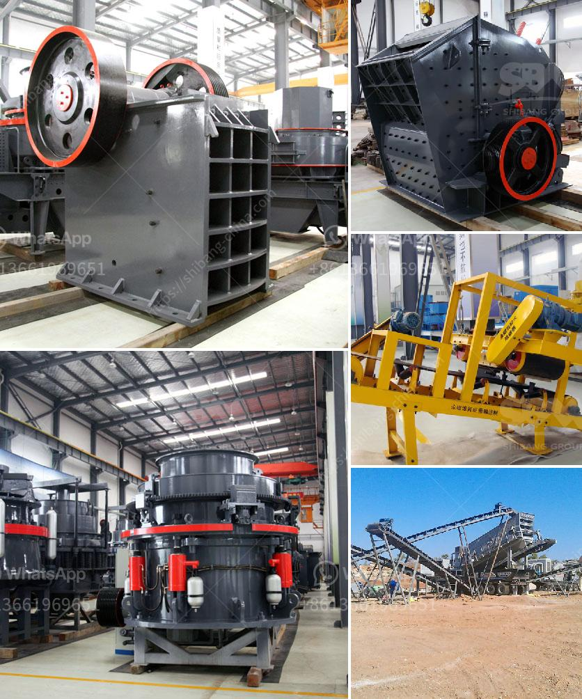

<h3>hammer mill buy</h3>
A hammer mill is a versatile machine used for grinding or pulverizing materials into fine particles. This mechanical device is commonly used in various industries, including agriculture, mining, and waste management. If you are considering investing in a hammer mill, you will realize the numerous benefits it can offer to your business operations.

One of the primary advantages of a hammer mill is its ability to grind a wide range of materials. From grains such as corn, wheat, and barley, to industrial materials like coal, limestone, and biomass, a hammer mill can effectively pulverize them into consistent sizes. This versatility allows you to produce different types of products, such as animal feed, biofuel, or even fine powders for pharmaceutical applications.

In addition to its versatility, a hammer mill offers efficiency and cost-effectiveness. With its powerful rotor and multiple hammers, this machine can quickly and efficiently grind large quantities of materials. The grinding process is also known for its uniformity, ensuring consistent particle sizes. By reducing the size of the materials, a hammer mill helps improve the efficiency of downstream operations, such as mixing, blending, or extrusion.

Another important aspect to consider when purchasing a hammer mill is its durability and reliability. Hammer mills are built to withstand heavy-duty applications and continuous operation. The robust construction and high-quality materials used in its fabrication ensure a long lifespan and minimal maintenance requirements. This means that once you invest in a hammer mill, you can rely on its performance for years to come.

When deciding to buy a hammer mill, you also have the option of choosing between various models and designs, depending on your specific needs. Some hammer mills come with additional features, such as screens or interchangeable grinding plates, allowing you to customize the output size. Others may offer adjustable speed or torque control, enhancing the machine's flexibility and adaptability.

Furthermore, technological advancements have led to the development of advanced hammer mill designs, incorporating innovative features to further improve its performance. For instance, some models now include built-in air classifiers, which help separate fine particles from coarse ones during the grinding process. This not only improves the efficiency of the mill but also enhances the quality of the final product.

In conclusion, a hammer mill is a smart investment for businesses operating in various industries. Its versatility, efficiency, durability, and customization options make it a valuable asset for grinding and pulverizing materials of different types and sizes. If you are looking to optimize your production processes, increase your output quality, and reduce operational costs, then buying a hammer mill should be a top consideration. Remember to assess your specific requirements, research different models, and consult with reputable suppliers to find the most suitable hammer mill for your business needs.
<h3>Contact us</h3><ul><li><strong>Whatsapp:&nbsp;<a href="https://wa.me/8613661969651">+8613661969651</a></strong></li><li><a href="https://swt.shibang-china.com/?git&amp;zhl&amp;hammer mill buy"><strong>Online Service(chat now)</strong></a></li></ul><h3>Related</h3><ul><li><a href='mobile stone crushing plants price.md'>mobile stone crushing plants price</a></li><li><a href='cold roll mills in turkey.md'>cold roll mills in turkey</a></li><li><a href='gold refinery in philippines south africa.md'>gold refinery in philippines south africa</a></li><li><a href='clinker grinding plant setup cost in india.md'>clinker grinding plant setup cost in india</a></li><li><a href='what can be produced on hammer crusher.md'>what can be produced on hammer crusher</a></li></ul>