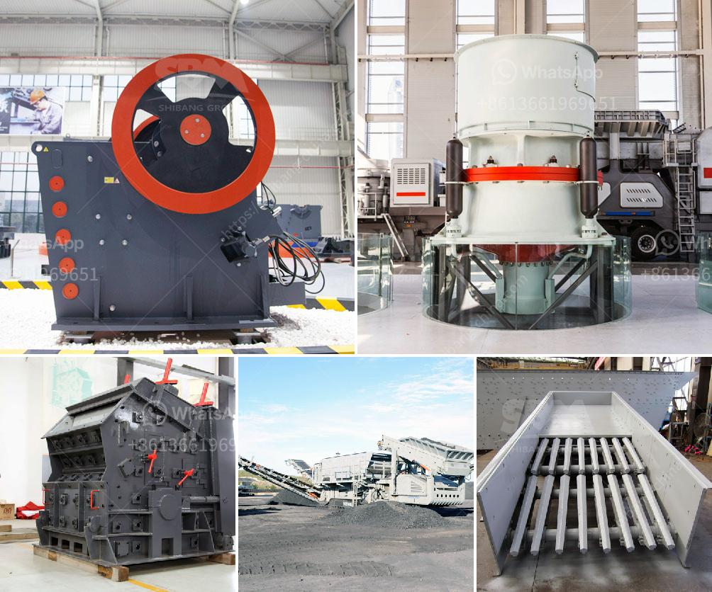

<h3>hammer mill for 200 mesh powder</h3>
Grinding processes require a fine powder product output that is easily manageable and consistent. Grinding is used to reduce the size of a particular material, allowing for more efficient processing, such as extracting valuable minerals from ore. However, achieving the desired particle size can be a challenge.

This is where the hammer mill comes into play. A hammer mill is a high-speed machine that pulverizes materials into fine particles. It consists of a rapidly rotating rotor, which delivers the material to be ground at high impact velocities. The particles are then forced through a mesh screen, which determines the size of the final product.

In the case of producing 200 mesh powder, a hammer mill is generally preferred due to its efficiency and versatility. The ability to adjust the screen size and rotor speed enables fine-tuning of the grinding process to suit specific material properties. This results in consistent and precise particle size control within the desired range.

The 200 mesh powder produced using a hammer mill is commonly used for various applications in industries such as chemical, pharmaceutical, and food. It is versatile enough to handle a wide range of materials, including powders, granules, and even some fibrous material. This versatility makes the hammer mill an essential tool in various grinding operations.

Furthermore, the hammer mill offers other significant advantages. It is relatively low maintenance, with simple cleaning and screen replacement procedures. It is also energy efficient, ensuring optimal use of power while delivering high grinding capacity. Additionally, the compact design allows for easy integration into existing production lines or installation in limited spaces.

In conclusion, the hammer mill is a versatile and efficient machine for producing 200 mesh powder. Its ability to adjust the screen size and rotor speed ensures precise control of particle size, while its versatility makes it suitable for a wide range of materials. As such, it is a valuable tool in grinding operations across various industries.
<h3>Contact us</h3><ul><li><strong>Whatsapp:&nbsp;<a href="https://wa.me/8613661969651">+8613661969651</a></strong></li><li><a href="https://swt.shibang-china.com/?git&amp;zhl&amp;hammer mill for 200 mesh powder"><strong>Online Service(chat now)</strong></a></li></ul><h3>Related</h3><ul><li><a href='layout design for stone crushing plant.md'>layout design for stone crushing plant</a></li><li><a href='quarry crusher for sale in ghana.md'>quarry crusher for sale in ghana</a></li><li><a href='marble crusher machines usa.md'>marble crusher machines usa</a></li><li><a href='calcium carbonate plant layout diagram.md'>calcium carbonate plant layout diagram</a></li><li><a href='slag crushing machine hopper in india.md'>slag crushing machine hopper in india</a></li></ul>