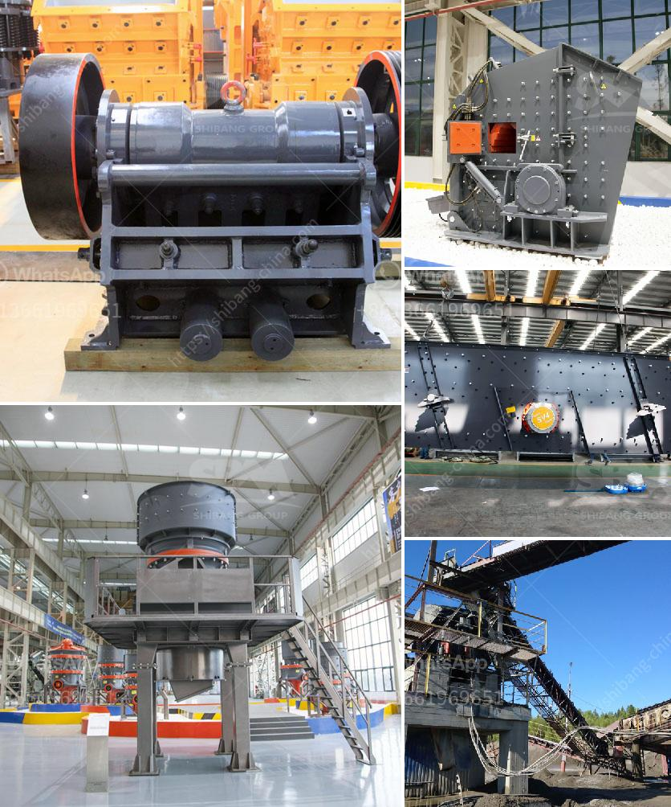

<h3>hammer mill for sale gumtree</h3>
Are you searching for a reliable and efficient grinding machine to process various materials? Look no further than a hammer mill! A hammer mill is a versatile machine that can be used for a range of applications, from grinding grains and animal feed to crushing rocks and shredding waste materials. If you're in the market for a hammer mill, look out for the amazing deals offered on Gumtree.

Gumtree, a popular online classifieds platform, provides a wide range of products and services to its users. The platform is known for its diverse offerings and competitive prices. When searching for a hammer mill for sale on Gumtree, you will find a variety of options suitable for both small-scale and large-scale grinding operations. The platform connects buyers and sellers, making it easy to find the perfect hammer mill to meet your specific requirements.

A hammer mill consists of a rotating shaft with hammers attached to it. The hammers beat the material being fed into the machine, thus grinding it into smaller particles. The size of the final product depends on the size of the perforated screen used in the mill. This versatility allows you to achieve different particle sizes as required for various applications.

One of the key advantages of using a hammer mill is its ability to grind a wide range of materials. Whether you need to grind grains, such as corn or wheat, for animal feed or want to crush rocks and break down waste materials, a hammer mill can efficiently handle it all. This makes it a valuable tool for industries such as agriculture, mining, recycling, and more.

When searching for a hammer mill on Gumtree, you will come across both brand new and used options. Buying a used hammer mill can be a great way to save money without compromising on quality. Many sellers on Gumtree offer fully operational and reliable used hammer mills that can be a cost-effective option for your grinding needs. However, if you prefer a brand new hammer mill, you can find sellers offering both local and international brands, ensuring that you get a high-quality machine that meets your expectations.

Before making a purchase, consider factors such as the capacity and power requirements of the hammer mill. This will depend on the volume of material you need to process and the level of grinding required. Additionally, ensure that the machine comes with all the necessary safety features, such as guards and emergency stop buttons, to ensure operator safety.

In conclusion, a hammer mill is an ideal grinding machine for various materials, and Gumtree provides a wide range of options for those looking to purchase one. Whether you need a hammer mill for grinding grains, crushing rocks, or shredding waste materials, there's a suitable machine available on Gumtree. Take advantage of the classifieds platform to find a great deal on a reliable and efficient hammer mill that can meet your specific grinding needs.
<h3>Contact us</h3><ul><li><strong>Whatsapp:&nbsp;<a href="https://wa.me/8613661969651">+8613661969651</a></strong></li><li><a href="https://swt.shibang-china.com/?git&amp;zhl&amp;hammer mill for sale gumtree"><strong>Online Service(chat now)</strong></a></li></ul><h3>Related</h3><ul><li><a href='jaw roll crusher.md'>jaw roll crusher</a></li><li><a href='second hand mobile crushers and screens south africa.md'>second hand mobile crushers and screens south africa</a></li><li><a href='removing iron from silica sand.md'>removing iron from silica sand</a></li><li><a href='mobile crusher tanzania.md'>mobile crusher tanzania</a></li><li><a href='calcium carbonate rock crusher.md'>calcium carbonate rock crusher</a></li></ul>