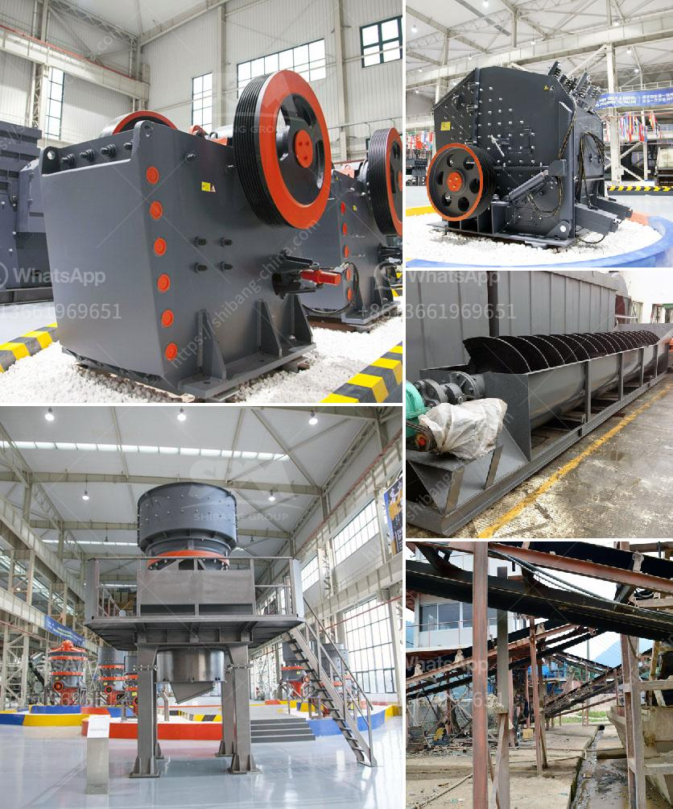

<h3>hammer mill for sale philippines</h3>
Hammer mill for sale Philippines is a machine used to reduce the size of particles with a uniform shape and size. Hammer mills have a rotating shaft with numerous metal hammers attached to them. These hammers strike the material that is fed into the mill, breaking it into smaller pieces. The size and distribution of the particles created by the hammer mill depend on the type of material being processed, the speed of the hammer mill, and the size of the screen used.

In the Philippines, hammer mills are mostly used for crushing agricultural materials such as corn, rice husks, peanut shells, coconut shells, and sorghum. The purpose of the hammer mill is to shred or crush material into smaller pieces by the repeated blows of hammers mounted on a rotating shaft.

Depending on the application, the hammer mill can process materials that range in size from 5mm to 25mm. It is capable of handling larger feed sizes (up to 300mm) while achieving smaller particles. The hammer mill has a high reduction ratio and produces a very fine grind.

The hammer mill is suitable for processing a wide variety of materials. It is particularly well suited for producing high-quality fluff for the absorbent and non-woven fiber markets. The hammer mill can also be used to process wet or dry granulations and disperse powder mixtures.

The particle size range of the hammer mill is determined by the screen size, which is chosen based on the desired particle size. Smaller particles pass through the screen and larger particles remain in the grinding chamber until they are broken down to the desired size.

One of the advantages of the hammer mill is its ability to produce a wide range of particle sizes. With the use of interchangeable screens, the hammer mill can produce different particle sizes ranging from coarse to fine.

Another advantage of the hammer mill is its versatility. It can be used to process a wide variety of materials, including fibrous materials such as bamboo, wood pulp, and other biomass materials. The hammer mill can also process sticky materials and materials with high moisture content.

1. Capacity - The capacity of the hammer mill will determine the throughput and efficiency of the grinding process. It is important to choose a hammer mill with a capacity that matches the anticipated demand for the finished product.

2. Construction - The construction of the hammer mill should be sturdy and durable to withstand the rigors of continuous operation. It should be made of high-quality materials that can withstand wear and tear.

3. Maintenance - The hammer mill should be easy to maintain and service. It is important to choose a hammer mill that comes with a comprehensive maintenance manual and spare parts availability.

4. Price - The price of the hammer mill should be affordable and within your budget. It is important to compare prices from different suppliers and choose one that offers the best value for your money.

In conclusion, a hammer mill is a versatile machine that can be used for a wide range of materials and particle sizes. It is suitable for processing agricultural materials in the Philippines and can provide high-quality fluff for various industries. When purchasing a hammer mill, it is important to consider factors such as capacity, construction, maintenance, and price to ensure you get the best machine for your needs.
<h3>Contact us</h3><ul><li><strong>Whatsapp:&nbsp;<a href="https://wa.me/8613661969651">+8613661969651</a></strong></li><li><a href="https://swt.shibang-china.com/?git&amp;zhl&amp;hammer mill for sale philippines"><strong>Online Service(chat now)</strong></a></li></ul><h3>Related</h3><ul><li><a href='crusher power consumption.md'>crusher power consumption</a></li><li><a href='rumus perhitungan kapasitas jaw crusher.md'>rumus perhitungan kapasitas jaw crusher</a></li><li><a href='basalt processing machine.md'>basalt processing machine</a></li><li><a href='price of jaw crusher.md'>price of jaw crusher</a></li><li><a href='second stone crusher for sale philippines.md'>second stone crusher for sale philippines</a></li></ul>