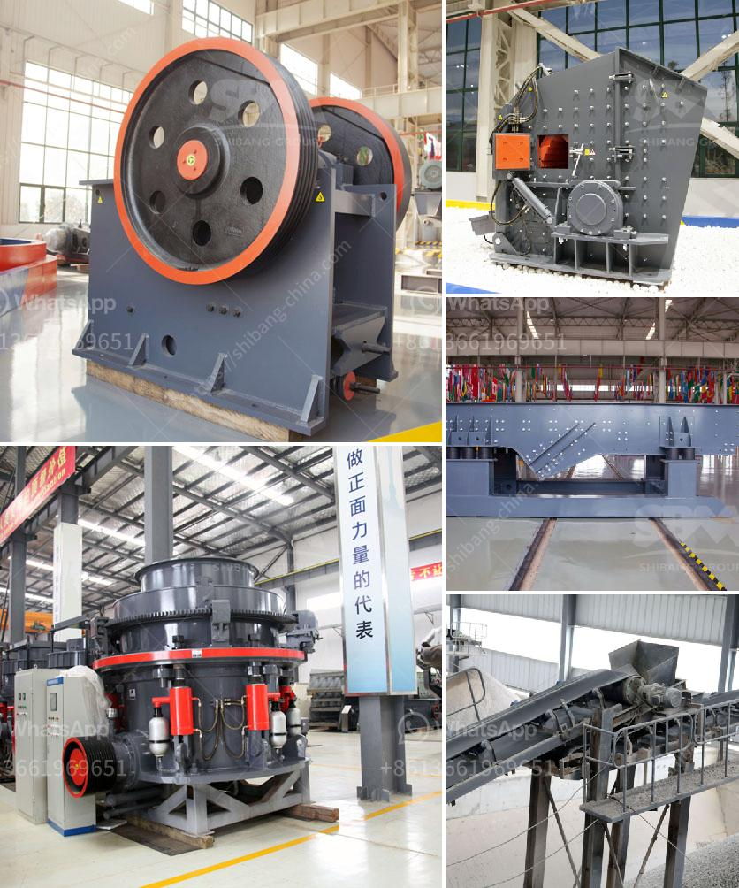

<h3>hammer mill machine 20hp</h3>
The hammer mill machine is a type of machine that utilizes hammer blades to crush and pulverize a wide variety of materials. The machine is also known as the hammer mill grinder, industrial hammer mill, and impact crusher. It is commonly used in grinding and crushing materials in the food, agricultural, and feed processing industries.

One of the significant advantages of the hammer mill machine is its versatility. It can process a wide range of materials, including grains, spices, herbs, and wood. This machine is equipped with hammers that rotate at high speeds within a chamber. The hammers strike the material repeatedly, causing it to be reduced in size until it passes through a screen or grate.

The design of the hammer mill machine ensures that the material is evenly distributed and effectively crushed. The machine's efficiency is further enhanced by the high rotational speed of the hammers, which ensures optimal grinding. The size and configuration of the hammers can be adjusted depending on the specific material and desired output.

The hammer mill machine is commonly used in the agricultural industry for crushing grains, animal feed, and biomass materials. It is also utilized in industrial settings for grinding waste materials, recycled products, and various raw materials. The hammer mill machine has several applications in various industries, including ethanol plants, food processing, ethanol plants, and wood processing.

The 20HP hammer mill machine is designed with a powerful engine for efficient and smooth operation. This machine is capable of delivering a consistent and even grind for a wide range of materials. The 20HP motor can handle larger loads and can run for extended periods without overheating. Additionally, the machine is equipped with safety features to prevent accidents and injuries during operation.

The size and capacity of the hammer mill machine need to be considered when choosing the right machine for a specific application. The 20HP hammer mill machine is suitable for small to medium-sized operations that require a reliable and efficient grinding solution. It is capable of processing 300 to 500 pounds of material per hour, depending on the desired final product size and material characteristics.

Maintenance and upkeep of the hammer mill machine are essential to ensure prolonged and efficient operation. Regular inspection and cleaning of the machine, as well as routine lubrication, can help prevent breakdowns and extend the lifespan of the machine. It is necessary to inspect and replace worn-out hammers, screens, and other components to maintain optimal performance.

In conclusion, the hammer mill machine is a versatile and efficient machine for grinding and crushing various materials. It is commonly used in the food, agricultural, and feed processing industries. The 20HP hammer mill machine is designed for small to medium-sized operations and offers a reliable and efficient grinding solution. Regular maintenance and inspection are crucial for optimal performance and prolonged lifespan.
<h3>Contact us</h3><ul><li><strong>Whatsapp:&nbsp;<a href="https://wa.me/8613661969651">+8613661969651</a></strong></li><li><a href="https://swt.shibang-china.com/?git&amp;zhl&amp;hammer mill machine 20hp"><strong>Online Service(chat now)</strong></a></li></ul><h3>Related</h3><ul><li><a href='quartz processing machine.md'>quartz processing machine</a></li><li><a href='hard rock crushers manufacturers india.md'>hard rock crushers manufacturers india</a></li><li><a href='how much crusher plant cost.md'>how much crusher plant cost</a></li><li><a href='grinding balls in tanzania.md'>grinding balls in tanzania</a></li><li><a href='process of preparation of coal and asha.md'>process of preparation of coal and asha</a></li></ul>