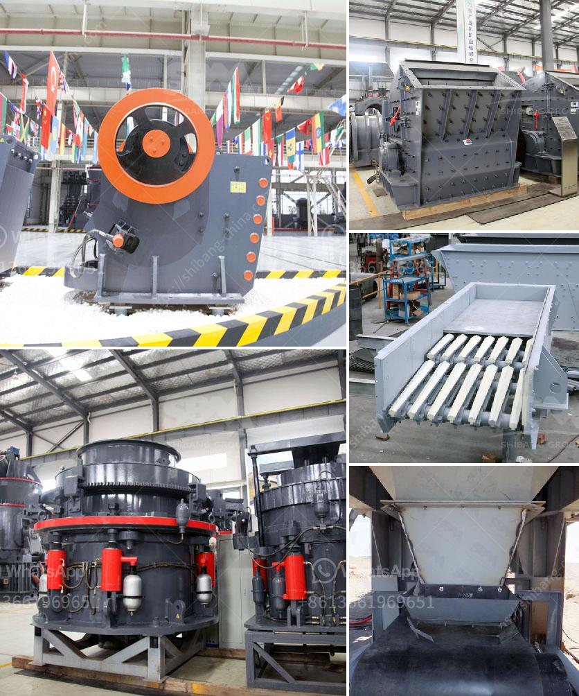

<h3>hammer mill mesin impor china</h3>
In the ever-evolving industrial landscape, new machinery and equipment are constantly being introduced to improve efficiency and productivity. One such machinery that has gained significant popularity in recent years is the hammer mill mesin impor China. This versatile piece of equipment has proven to be an essential tool for various industries, thanks to its ability to grind, shred, and pulverize a wide range of materials. Let us delve deeper into the features and benefits of the hammer mill mesin impor China and understand why it has become a go-to choice for numerous industrial applications.

The hammer mill mesin impor China is a high-speed, mechanically driven machine that utilizes hammers to shred and grind materials. It consists of a cylindrical casing, which houses the hammers and the grinding chamber. The rotating hammers inside the chamber deliver a powerful impact on the materials, effectively reducing them into smaller particles. The design of the hammer mill enables it to handle a variety of materials, including grains, wood chips, straw, biomass, and even minerals.

One of the key advantages of the hammer mill mesin impor China is its remarkable versatility. Its ability to process a wide range of materials makes it suitable for various industries, including agriculture, animal feed production, biomass processing, and recycling. In the agriculture sector, the hammer mill is used to grind grains and crops, making it easier to handle and store. Animal feed producers also rely on the hammer mill to process and grind different feed ingredients to create balanced, nutritious diets for livestock. The hammer mill is particularly effective in grinding tough and fibrous materials, such as corn stalks and straw.

Another noteworthy feature of the hammer mill mesin impor China is its efficiency and cost-effectiveness. The high-speed rotating hammers ensure a rapid and efficient grinding process, resulting in consistent particle size reduction. This uniformity in particle size is essential for industries that require precise and uniform end products. The efficient operation of the hammer mill translates into increased productivity and reduced energy consumption.

Furthermore, the hammer mill mesin impor China is designed to be user-friendly and low maintenance. The machine's simple structure and easy-to-use controls allow operators to quickly and effortlessly adjust settings and perform routine maintenance. This not only saves valuable time but also minimizes downtime, ensuring uninterrupted production.

In conclusion, the hammer mill mesin impor China has become an indispensable machine for various industries due to its versatility, efficiency, and cost-effectiveness. Its ability to handle a wide range of materials and deliver consistent particle size reduction has made it a preferred choice for agriculture, animal feed production, biomass processing, and recycling. Its user-friendly design and low maintenance requirements make it a reliable and efficient machinery option for businesses of all sizes. As industry needs continue to evolve, the hammer mill mesin impor China has proven itself to be a valuable tool in meeting the demand for efficient and reliable material processing.
<h3>Contact us</h3><ul><li><strong>Whatsapp:&nbsp;<a href="https://wa.me/8613661969651">+8613661969651</a></strong></li><li><a href="https://swt.shibang-china.com/?git&amp;zhl&amp;hammer mill mesin impor china"><strong>Online Service(chat now)</strong></a></li></ul><h3>Related</h3><ul><li><a href='nigeria ball mill pakistan.md'>nigeria ball mill pakistan</a></li><li><a href='stone crushing production line.md'>stone crushing production line</a></li><li><a href='carbon black pulverizer.md'>carbon black pulverizer</a></li><li><a href='ball mill grinding media.md'>ball mill grinding media</a></li><li><a href='marble ball mill.md'>marble ball mill</a></li></ul>