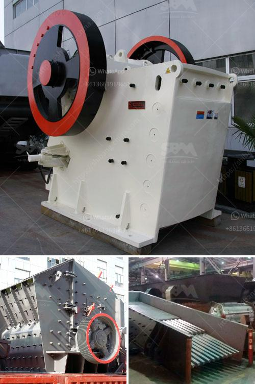

<h3>hammer mill mining</h3>
Mining plays a crucial role in the global economy. From extracting precious metals to producing various industrial minerals, mining operations have vast importance. And one of the essential tools used in mining is the hammer mill. 

A hammer mill is a specialized machine designed to crush and pulverize materials such as rocks, minerals, or waste materials into smaller pieces, commonly known as aggregates. It is used in various industries, including mining, construction, and waste management. In the mining sector, hammer mills are used to crush ore into smaller sizes, enabling easier extraction of valuable minerals.

The operation of a hammer mill involves a rotating shaft fitted with free-swinging hammers, which strike and crush the ore or material being processed. The hammers are attached to the rotor of the mill, typically through pins or discs, ensuring effective pulverization. As the rotor rotates, the hammers move rapidly, creating a high-velocity impact against the materials, resulting in size reduction.

Hammer mills used in mining are often robustly constructed and designed to withstand the harsh conditions of mining environments. They are typically made of durable materials such as hardened steel or cast iron, known for their strength and resistance to wear and tear. The robust construction enables the equipment to handle various types of material, from soft to hard rocks, without compromising its efficiency and performance.

Hammer mills offer several advantages in mining operations. Firstly, they can reduce the size of ore or material efficiently, allowing for better extraction of valuable minerals. Crushing the material into smaller particles also facilitates downstream processes such as grinding and mineral separation. Secondly, hammer mills can handle a wide range of materials, making them versatile in mining operations. Whether it is hard rock, soft ore, or even industrial waste materials, hammer mills can effectively process them, ensuring optimal utilization of resources.

Furthermore, hammer mills are cost-effective tools for mining operations. They require relatively low initial investment compared to other crushing and grinding equipment. Additionally, their simple design and ease of maintenance contribute to reduced operational costs. The minimal moving parts and accessible components make it easier for operators to inspect, repair, or replace them when necessary, ensuring minimal downtime and maximum productivity.

However, despite their numerous benefits, hammer mills also have limitations. The equipment's capacity may be limited, depending on the size and design of the mill. Therefore, it is essential to choose the appropriate hammer mill based on the specific requirements of the mining operation. Additionally, depending on the material being processed, some materials may be more challenging to crush than others.

In conclusion, hammer mills are valuable equipment in mining operations. They play a crucial role in reducing the size of ore or waste materials, enabling easier extraction and processing. With their robust construction, versatility, and cost-effectiveness, hammer mills are widely used in the mining industry. However, careful consideration should be given to select the appropriate hammer mill for a specific mining operation, ensuring optimal performance and productivity.
<h3>Contact us</h3><ul><li><strong>Whatsapp:&nbsp;<a href="https://wa.me/8613661969651">+8613661969651</a></strong></li><li><a href="https://swt.shibang-china.com/?git&amp;zhl&amp;hammer mill mining"><strong>Online Service(chat now)</strong></a></li></ul><h3>Related</h3><ul><li><a href='wet ball milling vs dry ball milling.md'>wet ball milling vs dry ball milling</a></li><li><a href='hammer crusher hammer balancing chart.md'>hammer crusher hammer balancing chart</a></li><li><a href='harga mesin molen di medan.md'>harga mesin molen di medan</a></li><li><a href='smallest gold crushing and washing plant.md'>smallest gold crushing and washing plant</a></li><li><a href='made in germany stone crusher.md'>made in germany stone crusher</a></li></ul>