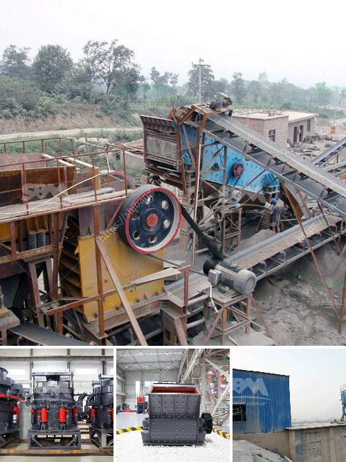

<h3>hammer mill sales in zimbabwe</h3>
The population of Zimbabwe is growing rapidly, creating a huge demand for food. The agricultural sector is the key to addressing this demand and achieving food security in the country. However, Zimbabwe faces various challenges that affect agricultural productivity, such as a lack of modern machinery and inefficient farming techniques. One essential piece of equipment that is necessary for successful farming is the hammer mill.

A hammer mill is a versatile machine that is used to pulverize different materials, such as grains, straw, wood chips, and other agricultural residues. Hammer mills are also used for recycling purposes. They can reduce bulk waste materials into small size, making it easier to handle and dispose of. Additionally, hammer mills are employed in various industries, including pharmaceutical, chemical, and mining, for size reduction of different materials.

In Zimbabwe, the absence of affordable and reliable machinery has hindered the progress of the agricultural sector. Farmers have to rely on traditional and time-consuming methods to process their crops. This not only affects their productivity but also limits their income generation potential. 

Fortunately, the hammer mill industry is experiencing a significant growth in Zimbabwe. Many local businessmen and entrepreneurs have spotted the opportunity to provide modern machinery to farmers, enabling them to increase their yields and income. The sales of hammer mills have seen a positive trend in recent years, with more and more farmers investing in this essential equipment.

One of the primary reasons for the growing demand for hammer mills in Zimbabwe is their cost-effectiveness. Compared to other machinery options, such as threshers and mills, hammer mills are relatively affordable and easy to maintain. They require minimal power consumption, reducing operational costs for farmers. Moreover, their versatile nature allows farmers to use them for multiple purposes, making them a cost-effective investment.

Another significant advantage of hammer mills is their ability to produce consistent and high-quality products. Hammer mills use rotating hammers to grind and pulverize materials, resulting in a uniform particle size. This is crucial in the agricultural sector, as it ensures consistent feed for livestock or uniform size reduction for various crops. The high-quality output from hammer mills allows farmers to produce superior products that can fetch better prices in the market.

Furthermore, hammer mills contribute to improved sustainability in agriculture. The use of modern machinery promotes efficient crop utilization and waste management. Hammer mills can process crop residues and agricultural waste into valuable products. For instance, straw can be transformed into animal feed or bedding material, reducing the environmental impact of crop residues and generating additional income for farmers.

In conclusion, the increasing sales of hammer mills in Zimbabwe are a positive sign for the agricultural sector. The demand for modern machinery and the need for improved farming techniques are driving the growth of the hammer mill industry. With their cost-effectiveness, versatility, and ability to produce consistent and high-quality products, hammer mills have the potential to revolutionize agriculture in Zimbabwe. By adopting these machines, farmers can enhance their productivity, increase their income, and contribute to the overall development of the country's agricultural sector.
<h3>Contact us</h3><ul><li><strong>Whatsapp:&nbsp;<a href="https://wa.me/8613661969651">+8613661969651</a></strong></li><li><a href="https://swt.shibang-china.com/?git&amp;zhl&amp;hammer mill sales in zimbabwe"><strong>Online Service(chat now)</strong></a></li></ul><h3>Related</h3><ul><li><a href='price pe 600 and 900 stone crusher.md'>price pe 600 and 900 stone crusher</a></li><li><a href='crusher machine in pakistan.md'>crusher machine in pakistan</a></li><li><a href='marble grinding machines factory in turkey.md'>marble grinding machines factory in turkey</a></li><li><a href='rock stone crusher.md'>rock stone crusher</a></li><li><a href='marble paving making machinry price.md'>marble paving making machinry price</a></li></ul>