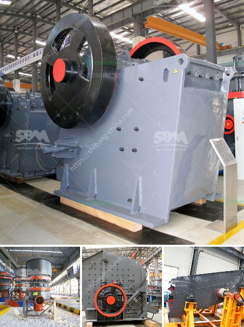

<h3>hard rock crushers manufacturers india</h3>
India is rich in mineral resources, with abundant reserves of limestone, coal, bauxite, copper, tin, and many others. To meet the requirements of various industries, such as mining, construction, energy, transportation, etc., these minerals need to be crushed into smaller pieces by hard rock crushers. The demand for these crushers in India is ever-growing, as more and more construction projects, road networks, and mining operations are being undertaken across the country.

Hard rock crushers are powerful machines that use mechanical force to break down rocks into smaller pieces. These machines come in several types, including jaw crushers, gyratory crushers, cone crushers, and impact crushers. Each of these types has its specific features and advantages, making them suitable for different applications.

One of the leading manufacturers of hard rock crushers in India is Amarshiva Engineering Company. They have been in the industry for over three decades, providing quality crushers and related equipment. Their jaw crushers are designed to process medium-hard to hard rocks, with a maximum pressure of 320 MPa. With a wide range of models available, Amarshiva Engineering Company offers reliable and efficient crushers for a variety of applications.

Another renowned manufacturer of hard rock crushers in India is Shakti Mining Equipments, with over three decades of experience in the industry. They offer jaw crushers, cone crushers, and vertical shaft impactors. Their crushers are designed to deliver maximum productivity and reliability, making them suitable for various mining and construction applications.

Larsen & Toubro Limited is yet another prominent manufacturer of hard rock crushers in India. They offer a wide range of jaw crushers, cone crushers, impact crushers, and mobile crushers. Their crushers are precision-engineered for maximum productivity and durability. Larsen & Toubro Limited's crushers are proven to withstand the harsh Indian conditions and deliver outstanding performance even in the most demanding applications.

These manufacturers, along with many others in India, are continuously investing in research and development to enhance the performance of their hard rock crushers. They are constantly coming up with innovative solutions to cater to the evolving needs of the industry. The Indian manufacturers are also focusing on offering eco-friendly crushers that reduce environmental impact, by incorporating features such as low noise levels and reduced dust emissions.

In conclusion, India has a thriving market for hard rock crushers due to its rich mineral resources and extensive construction projects. With several renowned manufacturers such as Amarshiva Engineering Company, Shakti Mining Equipments, and Larsen & Toubro Limited, the industry is well-equipped to meet the growing demand for reliable and efficient crushers. These manufacturers are continually improving their products to offer innovative solutions that cater to the diverse needs of the industry. As the demand for hard rock crushers continues to rise in India, these manufacturers play a crucial role in driving the country's infrastructure and mining sectors forward.
<h3>Contact us</h3><ul><li><strong>Whatsapp:&nbsp;<a href="https://wa.me/8613661969651">+8613661969651</a></strong></li><li><a href="https://swt.shibang-china.com/?git&amp;zhl&amp;hard rock crushers manufacturers india"><strong>Online Service(chat now)</strong></a></li></ul><h3>Related</h3><ul><li><a href='used sand screening equipment for sale.md'>used sand screening equipment for sale</a></li><li><a href='barite grinding equipment.md'>barite grinding equipment</a></li><li><a href='rock quarry crusher equipment.md'>rock quarry crusher equipment</a></li><li><a href='old hammer mill for sale.md'>old hammer mill for sale</a></li><li><a href='jaw rock crusher for sale.md'>jaw rock crusher for sale</a></li></ul>