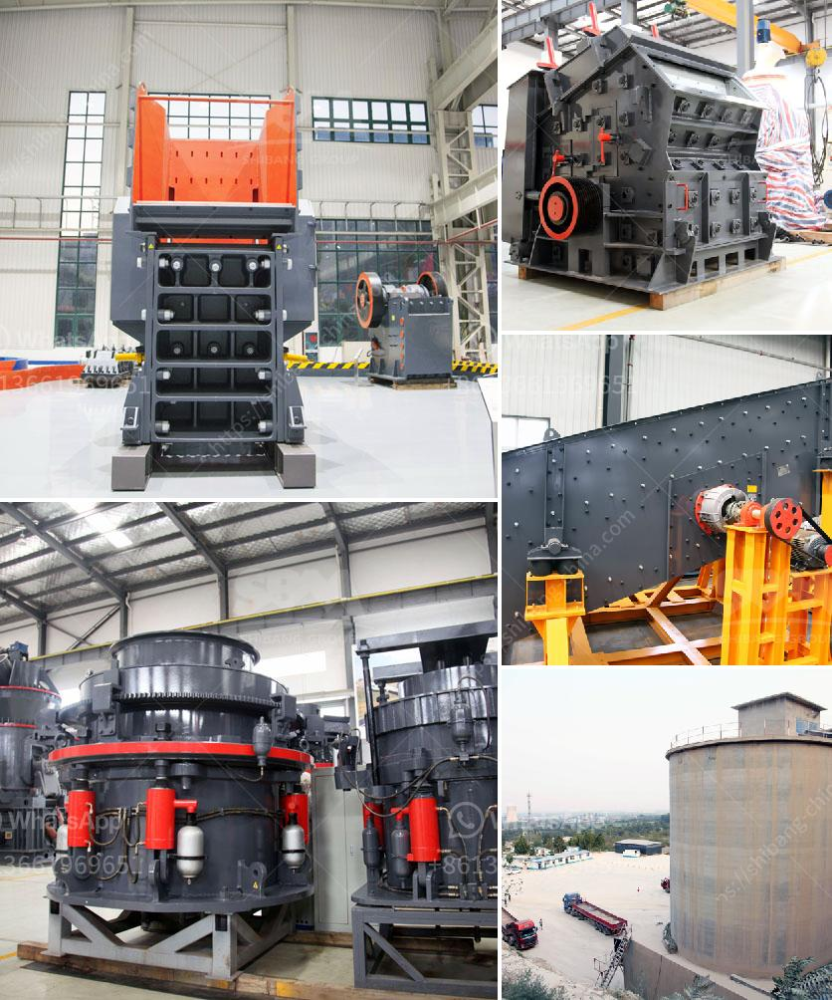

<h3>hard rock pulverizer crusher</h3>
Hard rock is a term that's widely used by geologists to describe solid, consolidated rocks that are typically found in the Earth's crust. These rocks are known for their high mineral content and extreme toughness, making them difficult to break down or pulverize. However, with the advent of modern technology and machinery, hard rock can now be processed efficiently and effectively using a hard rock pulverizer crusher.

A hard rock pulverizer crusher is specifically designed to crush hard rocks such as granite, basalt, and other similar materials into smaller pieces. This machine uses mechanical force to exert pressure on the rock, resulting in the crushing or pulverizing of the material into smaller, more manageable sizes.

One of the key components of a hard rock pulverizer crusher is the crushing chamber. This chamber houses a series of hardened steel hammers that rotate at high speed, striking the rocks with enough force to break them down. Additionally, the pulverizer crusher is equipped with a screen or grate at the bottom to control the size of the particles that are being produced.

The benefits of using a hard rock pulverizer crusher are immense. Firstly, it allows for the efficient processing of hard rocks, which were previously challenging to break down manually or with traditional crushing methods. Secondly, it significantly reduces the time and effort required to process large quantities of hard rock, making it a cost-effective solution for various industries such as mining, construction, and quarrying.

Furthermore, the hard rock pulverizer crusher is versatile and can be used in different applications. It can be configured to produce various sizes of crushed rock, depending on the specific requirements of the project. This flexibility ensures that the machine can be adjusted to meet the demands of different projects, making it a valuable asset for any operation dealing with hard rock.

In conclusion, the hard rock pulverizer crusher is a powerful machine designed to efficiently crush and pulverize hard rocks into smaller, more manageable sizes. This machine offers numerous benefits, including time and cost savings, as well as flexibility in terms of application. Whether it's for mining, construction, or quarrying purposes, the hard rock pulverizer crusher is an essential tool that ensures the successful processing of hard rocks efficiently and effectively.
<h3>Contact us</h3><ul><li><strong>Whatsapp:&nbsp;<a href="https://wa.me/8613661969651">+8613661969651</a></strong></li><li><a href="https://swt.shibang-china.com/?git&amp;zhl&amp;hard rock pulverizer crusher"><strong>Online Service(chat now)</strong></a></li></ul><h3>Related</h3><ul><li><a href='gypsum production plant suppliers in pakistan.md'>gypsum production plant suppliers in pakistan</a></li><li><a href='manganese metal production process.md'>manganese metal production process</a></li><li><a href='price of conveyor belts for soaps.md'>price of conveyor belts for soaps</a></li><li><a href='bentonite processing.md'>bentonite processing</a></li><li><a href='harga mesin molen di medan.md'>harga mesin molen di medan</a></li></ul>