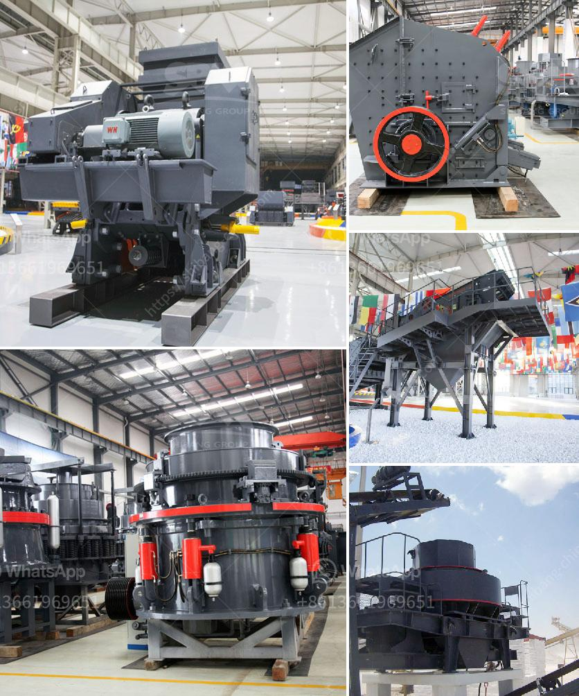

<h3>hard rock quarry crusher in libya</h3>
Located in the heart of Libya, Hard Rock Quarry in Al-Fulah is known for its exceptional quality crushed limestone. It is a fully functioning site, with all the necessary equipment and machinery needed for extracting, crushing, and screening limestone rocks. This quarry has been serving construction projects all over Libya for many years, providing the essential raw material required for various construction purposes.

At Hard Rock Quarry, the specialized crushers and advanced technology ensure that the limestone rocks are efficiently and effectively crushed into the required sizes. The powerful crushers can handle even the largest rocks, reducing them to smaller, more manageable pieces. The crushed limestone produced at this quarry is consistent in size and quality, making it a reliable choice for a multitude of applications.

One of the primary uses of the crushed limestone is in road construction. The superior quality of the crushed rocks ensures that roads built with this material are strong, durable, and long-lasting. The crushed limestone also acts as a solid base for other infrastructure projects, such as buildings, bridges, and airports. Its strength and stability make it an ideal choice for supporting heavy structures.

Apart from its use in construction, crushed limestone from Hard Rock Quarry has a range of other applications. It is commonly used as a base material for concrete and asphalt production, providing a solid foundation for these materials. Additionally, the crushed limestone can be used as a decorative landscaping element, adding a natural and aesthetic touch to gardens, walkways, and driveways.

The efficient operations at Hard Rock Quarry ensure a consistent supply of high-quality crushed limestone to meet the demands of various projects in Libya. The site's commitment to excellence is reflected in its quality control processes, continuous improvement initiatives, and dedicated workforce. Clients can rely on the quarry to deliver the required materials on time and within the specified quality standards.

Hard Rock Quarry is not only a reliable source of crushed limestone but also emphasizes environmental sustainability. The quarry operates in compliance with all environmental regulations, ensuring the protection of the surrounding ecosystem. The site incorporates measures to minimize dust, noise, and other negative impacts on the environment, demonstrating its commitment to responsible quarrying.

In conclusion, Hard Rock Quarry in Libya is a reputable source of crushed limestone, catering to the construction needs of the region. Its advanced technology, efficient operations, and commitment to quality make it a trusted choice for various construction projects. With its wide range of applications and emphasis on environmental sustainability, the quarry stands as a key contributor to the development and infrastructure of Libya.
<h3>Contact us</h3><ul><li><strong>Whatsapp:&nbsp;<a href="https://wa.me/8613661969651">+8613661969651</a></strong></li><li><a href="https://swt.shibang-china.com/?git&amp;zhl&amp;hard rock quarry crusher in libya"><strong>Online Service(chat now)</strong></a></li></ul><h3>Related</h3><ul><li><a href='calcite micronized manufacturing plant pdf.md'>calcite micronized manufacturing plant pdf</a></li><li><a href='cost per ton quarry production.md'>cost per ton quarry production</a></li><li><a href='jaw crusher saudi price.md'>jaw crusher saudi price</a></li><li><a href='types of vibratory screens.md'>types of vibratory screens</a></li><li><a href='how to remove gold dust from sand.md'>how to remove gold dust from sand</a></li></ul>