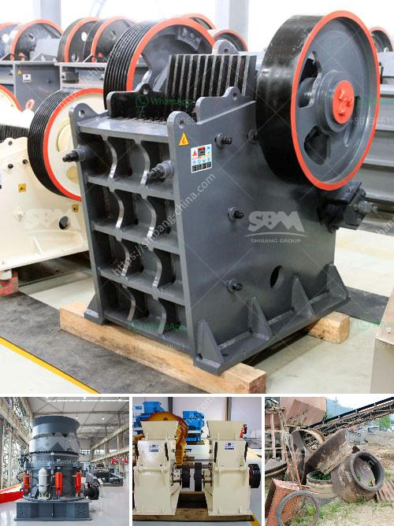

<h3>harga mesin crusher batu kapasitas 300 ton per jam</h3>
Crusher batu adalah mesin yang digunakan untuk menghancurkan batu menjadi ukuran yang lebih kecil. Mesin ini memiliki kapasitas yang bisa mencapai 300 ton per jam, sehingga sangat cocok digunakan untuk industri pertambangan atau konstruksi yang membutuhkan material batu dalam jumlah yang besar.

Harga mesin crusher batu kapasitas 300 ton per jam tentu menjadi hal yang sangat penting bagi para pengusaha yang menggunakan mesin ini. Harga tersebut bisa berbeda-beda tergantung pada merk dan spesifikasi mesin, serta juga faktor lain seperti lokasi pembelian dan biaya pengiriman.

Mesin crusher batu dengan kapasitas 300 ton per jam biasanya dilengkapi dengan vibrating screen atau salah satu komponen yang disebut-sebut sebagai "separator". Fungsinya adalah untuk memisahkan material yang sudah dihancurkan menjadi ukuran yang lebih halus sesuai dengan kebutuhan pengguna. Dengan adanya vibrating screen, proses penghancuran dan pengelompokan material menjadi lebih efisien.

Selain itu, mesin crusher batu dengan kapasitas 300 ton per jam juga dilengkapi dengan sistem penggerak yang kuat. Mesin ini biasanya menggunakan mesin diesel dengan tenaga yang besar agar bisa menghancurkan batu dengan mudah. Namun, ada juga mesin crusher batu dengan kapasitas yang sama yang menggunakan tenaga listrik sebagai sumber energinya.

Bagi para pengusaha pertambangan atau konstruksi, faktor kecepatan produksi menjadi hal yang sangat penting. Mesin crusher batu dengan kapasitas 300 ton per jam tentu memberikan keuntungan dalam hal ini. Dengan menggunakan mesin ini, para pengusaha bisa memenuhi kebutuhan material dalam waktu yang relatif singkat.

Untuk mendapatkan harga mesin crusher batu kapasitas 300 ton per jam yang terbaik, ada beberapa tips yang bisa dipertimbangkan. Pertama-tama, lakukan riset tentang berbagai merk dan model mesin yang tersedia di pasaran. Bandingkan spesifikasi dan fitur-fitur yang ditawarkan oleh masing-masing mesin agar bisa memilih yang paling sesuai dengan kebutuhan.

Selain itu, penting juga untuk mempertimbangkan aspek purna jual. Pastikan mesin crusher batu yang dibeli dilengkapi dengan garansi. Hal ini akan memberikan rasa aman bagi para pengusaha jika terjadi masalah pada mesin dalam jangka waktu tertentu setelah pembelian.

Terakhir, pastikan untuk membandingkan harga mesin crusher batu kapasitas 300 ton per jam di beberapa toko atau distributor yang berbeda. Dengan membandingkan harga, para pengusaha bisa mendapatkan penawaran terbaik dan menghemat anggaran pembelian.

Dalam industri pertambangan dan konstruksi, harga mesin crusher batu kapasitas 300 ton per jam merupakan investasi yang penting. Mesin ini membantu meningkatkan efisiensi produksi dan memenuhi kebutuhan material dengan jumlah yang besar dalam waktu yang relatif singkat. Dengan mempertimbangkan faktor-faktor seperti spesifikasi, purna jual, dan harga, para pengusaha bisa mendapatkan mesin crusher batu terbaik untuk bisnis mereka.
<h3>Contact us</h3><ul><li><strong>Whatsapp:&nbsp;<a href="https://wa.me/8613661969651">+8613661969651</a></strong></li><li><a href="https://swt.shibang-china.com/?git&amp;zhl&amp;harga mesin crusher batu kapasitas 300 ton per jam"><strong>Online Service(chat now)</strong></a></li></ul><h3>Related</h3><ul><li><a href='mobile stone crusher price canada.md'>mobile stone crusher price canada</a></li><li><a href='marble jaw crusher.md'>marble jaw crusher</a></li><li><a href='crusher stone sand making stone quarry.md'>crusher stone sand making stone quarry</a></li><li><a href='manufacturer of stone crusher.md'>manufacturer of stone crusher</a></li><li><a href='gold wash plants built in the northwest.md'>gold wash plants built in the northwest</a></li></ul>