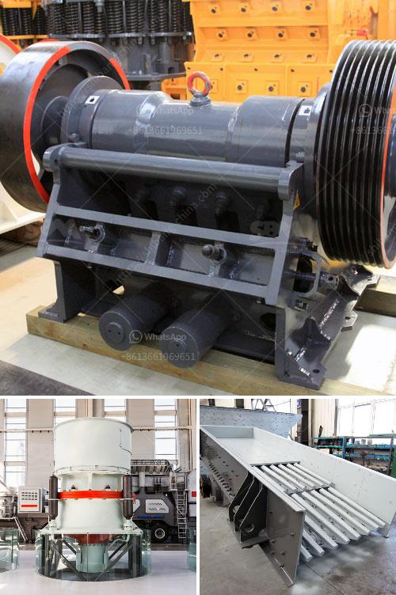

<h3>harga mesin molen di medan</h3>
When it comes to construction projects, having the right equipment can make all the difference. One essential machine in many construction sites is the molen machine. A molen machine, also known as a concrete mixer, is designed to mix cement, sand, and water to create concrete. In Medan, Indonesia, the harga mesin molen di Medan, or the price of molen machines in Medan, can vary depending on various factors.

The price of a molen machine can be influenced by several factors, including the brand, capacity, and type of machine. Different brands offer various features and quality levels, which can affect the price. Some popular brands in Medan include Honda, Tiger, and Mesin Molen. Each brand offers different models and capacities, ranging from small portable machines suitable for small construction projects to larger ones for more significant projects.

The capacity of the molen machine is another crucial factor that affects its price. The capacity refers to the volume of concrete that the machine can produce in a given time. Smaller machines with a capacity of around 50 liters are suitable for small-scale projects such as home renovations or small construction works. However, larger projects may require machines with a higher capacity, typically ranging from 70 to 120 liters or even more. The larger the capacity, the higher the price of the machine.

The type of molen machine is also a factor that affects its price. There are generally two types of molen machines: manual and automatic. Manual machines require manual labor to load and discharge the materials, while automatic machines have a built-in mechanism that does the job automatically. Automatic machines are generally priced higher than manual ones due to their advanced features and convenience.

In Medan, the harga mesin molen di Medan can range from IDR 2 million to IDR 10 million or even more, depending on the factors mentioned above. It is important to consider the specific needs of the construction project and budget constraints before deciding on a particular molen machine.

It is advisable to do some research and compare prices from different suppliers or manufacturers in Medan. Online platforms and local stores can provide a range of options to choose from. Additionally, it is essential to consider the reputation of the brand or manufacturer, as well as the warranty and after-sales service provided.

To conclude, the price of molen machines in Medan can vary depending on factors such as brand, capacity, and type. It is crucial to assess the specific needs of the project and budget constraints before making a purchase. Doing thorough research and comparing prices from different suppliers can help in finding the best harga mesin molen di Medan. With the right molen machine, construction projects in Medan can be executed efficiently and effectively.
<h3>Contact us</h3><ul><li><strong>Whatsapp:&nbsp;<a href="https://wa.me/8613661969651">+8613661969651</a></strong></li><li><a href="https://swt.shibang-china.com/?git&amp;zhl&amp;harga mesin molen di medan"><strong>Online Service(chat now)</strong></a></li></ul><h3>Related</h3><ul><li><a href='cost of conveyor belt system for coal loading.md'>cost of conveyor belt system for coal loading</a></li><li><a href='crusher hammer material grade.md'>crusher hammer material grade</a></li><li><a href='crusher plant in jizan saudi arabia.md'>crusher plant in jizan saudi arabia</a></li><li><a href='jaw and cone crusher suppliers in mokopane.md'>jaw and cone crusher suppliers in mokopane</a></li><li><a href='used stone crusher machine for sale in uae.md'>used stone crusher machine for sale in uae</a></li></ul>