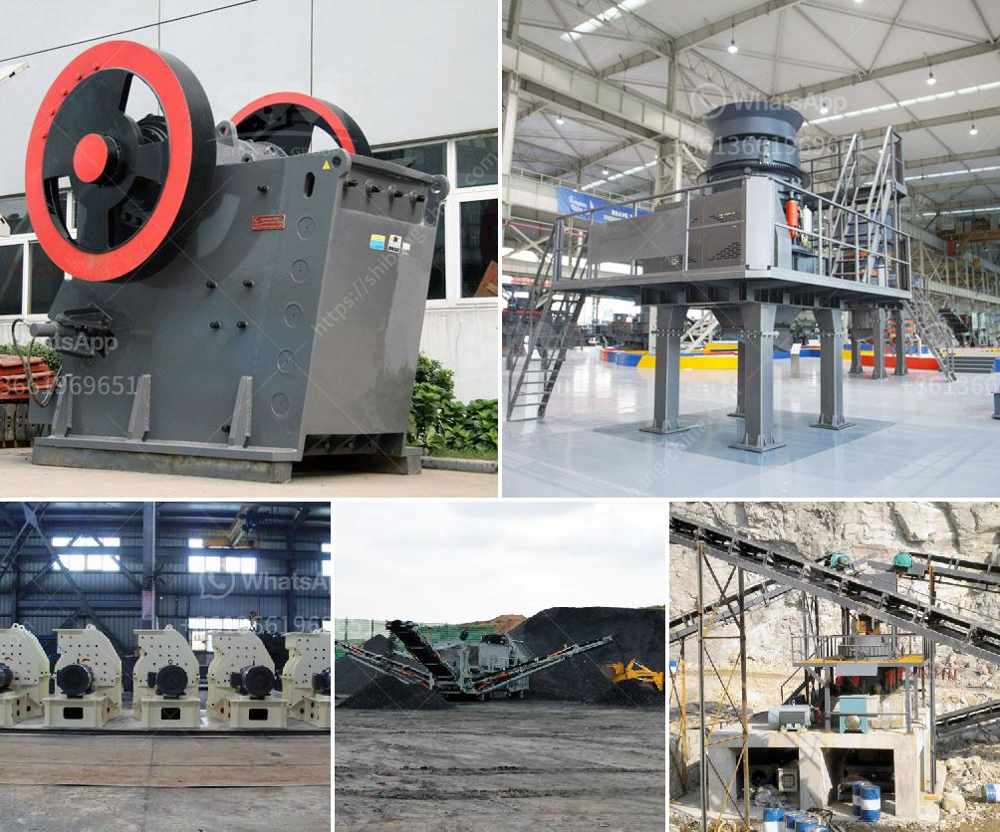

<h3>harga mesin pemecah batu merek jepang</h3>
Harga mesin pemecah batu merek Jepang telah menjadi sorotan dalam industri pertambangan dan konstruksi di Indonesia. Mesin pemecah batu, juga dikenal sebagai stone crusher, digunakan untuk menghancurkan batu besar menjadi ukuran yang lebih kecil, yang kemudian dapat digunakan untuk berbagai keperluan seperti konstruksi jalan, bangunan, pekerjaan pipa, dan banyak lagi.

Merek-merek Jepang telah lama dikenal dengan kualitas dan kehandalannya dalam berbagai sektor industri, termasuk mesin pemecah batu. Beberapa merek terkenal yang dihasilkan dari Jepang adalah Hitachi, Komatsu, dan Kawasaki. Dalam pembahasan ini, kita akan melihat mengapa harga mesin pemecah batu merek Jepang relatif tinggi, namun sebanding dengan kualitas dan kehandalan yang ditawarkannya.

Salah satu alasan mengapa harga mesin pemecah batu merek Jepang lebih mahal dibandingkan merek lainnya adalah karena kualitas material dan teknologi yang digunakan. Penggunaannya yang terbuat dari bahan berkualitas tinggi, seperti baja tahan karat dan baja paduan, menjadikan mesin ini lebih tahan terhadap aus dan kerusakan. Selain itu, merek Jepang juga menggunakan teknologi terkini untuk memastikan mesin memiliki performa yang optimal dan daya tahan yang lama. Mesin pemecah batu merek Jepang dirancang untuk dapat bekerja dengan efisien dalam jangka waktu yang lama, sehingga memberikan nilai tambah yang signifikan bagi pengguna.

Keandalan juga menjadi salah satu faktor utama mengapa mesin pemecah batu merek Jepang sangat diminati oleh perusahaan konstruksi dan pertambangan di Indonesia. Mesin Jepang dikenal memiliki keandalan yang tinggi dan performa yang konsisten. Hal ini penting, terutama di sektor konstruksi yang membutuhkan mesin yang dapat bekerja keras dan tetap stabil di bawah tekanan kerja yang berat. Dengan menggunakan mesin pemecah batu merek Jepang, pengguna dapat meminimalkan risiko downtime yang disebabkan oleh kerusakan mesin dan meningkatkan produktivitas perusahaan.

Keunggulan lainnya dari mesin pemecah batu merek Jepang adalah suku cadang yang mudah didapatkan. Banyak perusahaan yang menjual mesin pemecah batu merek Jepang yang menyediakan suku cadang lengkap dan mudah diakses. Hal ini meminimalkan waktu tunggu dan biaya yang dikeluarkan jika terjadi kerusakan pada mesin. Ketersediaan suku cadang yang baik juga memastikan bahwa mesin pemecah batu merek Jepang tetap dapat beroperasi dengan performa maksimal dalam jangka waktu yang lama.

Mesin pemecah batu merek Jepang memiliki keunggulan tambahan dalam hal penggunaan energi yang efisien. Dalam upaya untuk memenuhi persyaratan regulasi lingkungan yang semakin ketat, merek Jepang telah berinovasi untuk menghasilkan mesin pemecah batu yang lebih ramah lingkungan dan hemat energi. Dengan menggunakan teknologi terbaru, mesin pemecah batu merek Jepang dapat mengurangi konsumsi bahan bakar dan emisi yang merugikan lingkungan.

Harga yang tinggi yang dimiliki oleh mesin pemecah batu merek Jepang dapat diterima mengingat kualitas, kehandalan, dan keunggulan teknologi yang dimilikinya. Jepang telah membangun reputasi global dalam industri mesin, dan mesin pemecah batu merek Jepang tidak berbeda. Dalam jangka panjang, investasi dalam mesin pemecah batu merek Jepang dapat memberikan pengembalian yang lebih tinggi bagi perusahaan konstruksi dan pertambangan, berkat produktivitas yang lebih tinggi dan biaya perawatan yang lebih rendah.

Dalam kesimpulan, mesin pemecah batu merek Jepang menawarkan kualitas, kehandalan, dan teknologi yang tak terbantahkan. Meskipun harga mesin pemecah batu merek Jepang relatif tinggi, investasi ini sebanding dengan manfaat jangka panjang yang ditawarkannya. Oleh karena itu, jika Anda mencari mesin pemecah batu berkualitas, merek Jepang adalah pilihan yang tepat.
<h3>Contact us</h3><ul><li><strong>Whatsapp:&nbsp;<a href="https://wa.me/8613661969651">+8613661969651</a></strong></li><li><a href="https://swt.shibang-china.com/?git&amp;zhl&amp;harga mesin pemecah batu merek jepang"><strong>Online Service(chat now)</strong></a></li></ul><h3>Related</h3><ul><li><a href='stone crusher machine manufacturer in india.md'>stone crusher machine manufacturer in india</a></li><li><a href='cement mill vertical price in india.md'>cement mill vertical price in india</a></li><li><a href='silica sand crusher in turkey.md'>silica sand crusher in turkey</a></li><li><a href='stone quarry crusher companies in ghana.md'>stone quarry crusher companies in ghana</a></li><li><a href='type of ball mill.md'>type of ball mill</a></li></ul>