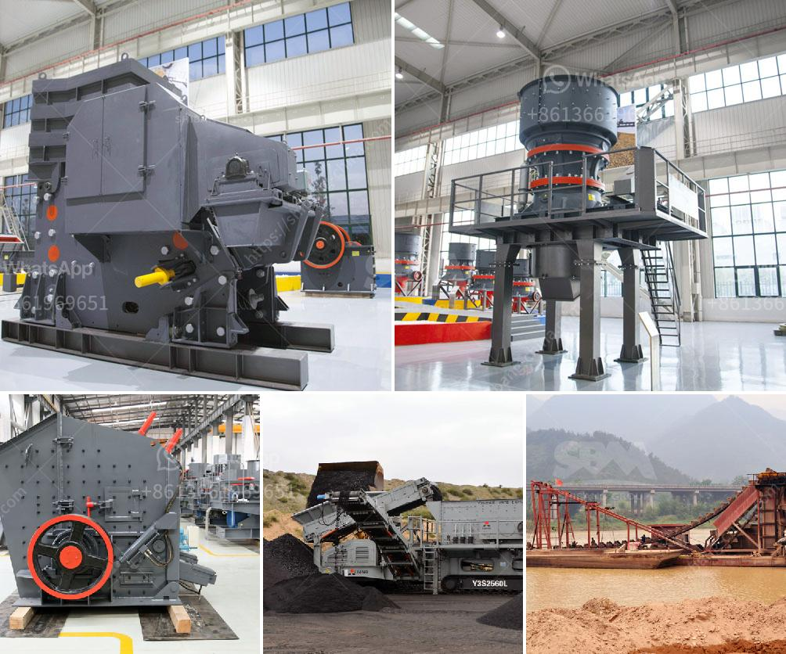

<h3>harga mesin sekunder stone crusher bekas</h3>
Stone crushing is often necessary in various sectors, such as construction, landscaping, and road work. The process of crushing large stones into smaller sizes is essential for these industries to produce materials for construction and other purposes. One of the crucial machines used in this process is the stone crusher.

Stone crushers come in different sizes and models. They are designed to break down stones into smaller pieces or even pulverize them into powder for diverse applications. There are primary crushers, which break down the initial stones into manageable sizes, and secondary crushers that further reduce the stones into the desired end product.

When it comes to the secondary crushing process, the harga mesin sekunder stone crusher bekas (the price of a second-hand secondary stone crusher) is always an important consideration. This affordability is especially relevant for small or medium-sized businesses that cannot invest in expensive new machinery.

The market for second-hand stone crushers offers a wide range of options for buyers. These machines may have been previously used, but they can still perform exceptionally well. In fact, some older models may even have advantages over newer ones since they were built with different engineering techniques that can enhance performance.

The harga mesin sekunder stone crusher bekas can vary widely depending on several factors. One of the most important aspects is the condition of the machine. A well-maintained stone crusher in good working condition will have a higher price compared to a worn-out or damaged one.

The brand and model of the stone crusher also affect its price. Different brands have different production capacities, features, and overall quality. Some well-known brands may be pricier due to their reputations for durability and performance. However, lesser-known brands may offer similar performance at a more affordable price.

Additionally, the size and specifications of the stone crusher play a significant role in determining its price. Crushers with higher production capacities or those equipped with advanced features will typically have a higher price tag. However, it's crucial to consider the specific needs of your business when deciding on the appropriate machine.

Purchasing a harga mesin sekunder stone crusher bekas can be an excellent investment for businesses in need of a reliable and cost-effective crushing solution. By opting for a second-hand machine, companies can save a significant amount of money while still achieving their desired production goals.

To ensure a successful purchase, it's essential to thoroughly inspect and test the used stone crusher before finalizing the transaction. By hiring a professional mechanic or technician, you can identify any potential issues or damages that may require repairs or replacements.

In conclusion, the harga mesin sekunder stone crusher bekas offers an affordable option for businesses in need of a reliable stone crushing machine. By carefully considering the condition, brand, model, size, and specifications, companies can find a second-hand crusher that meets their requirements without breaking the bank. With proper maintenance and care, a used stone crusher can deliver exceptional performance and provide long-term value for money.
<h3>Contact us</h3><ul><li><strong>Whatsapp:&nbsp;<a href="https://wa.me/8613661969651">+8613661969651</a></strong></li><li><a href="https://swt.shibang-china.com/?git&amp;zhl&amp;harga mesin sekunder stone crusher bekas"><strong>Online Service(chat now)</strong></a></li></ul><h3>Related</h3><ul><li><a href='price of crusher machine.md'>price of crusher machine</a></li><li><a href='sand making machine south africa price.md'>sand making machine south africa price</a></li><li><a href='mining plant for sale harare zimbabwe.md'>mining plant for sale harare zimbabwe</a></li><li><a href='300 tons per hour mobile crawler crusher price.md'>300 tons per hour mobile crawler crusher price</a></li><li><a href='limestone ball mill machine.md'>limestone ball mill machine</a></li></ul>