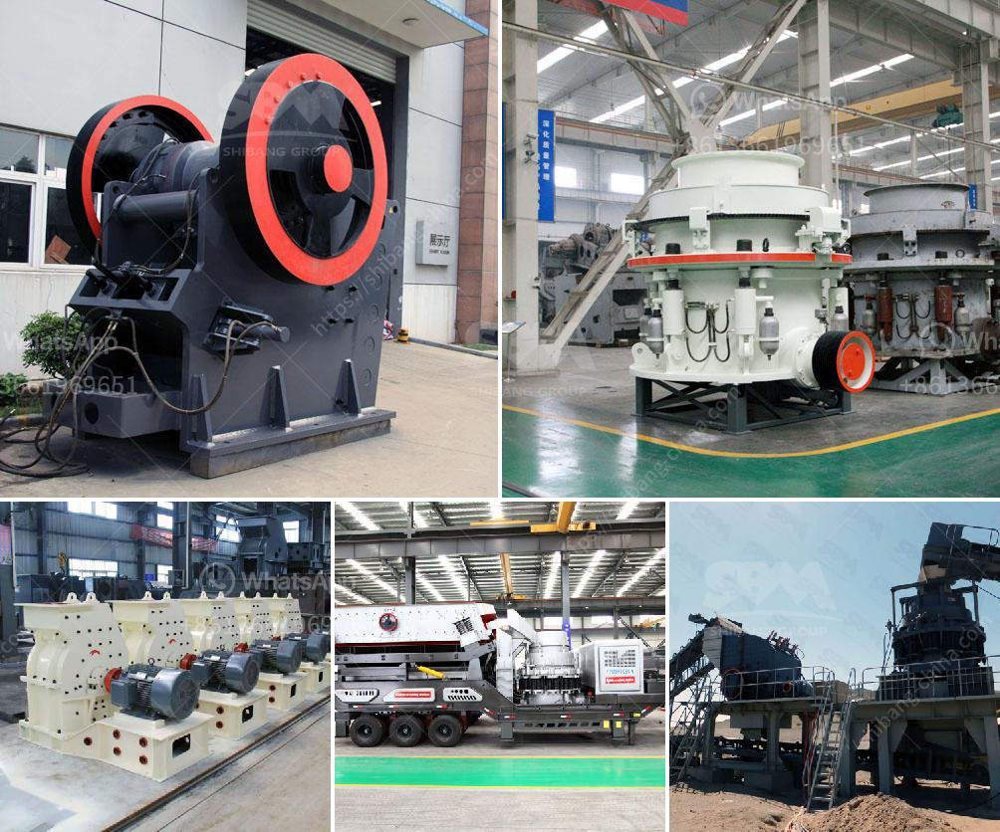

<h3>harga mobile stone crusher surabaya</h3>
The stone crusher is a machine that is used to crush stones into various sizes according to the requirements. Typically, this machine is used in construction sites to process stones into smaller pieces to be used for construction purposes. These machines come in different sizes and can be operated either manually or automatically.

One of the cities in Indonesia where the use of stone crushers is prevalent is Surabaya. Surabaya is one of the largest cities in Indonesia and the capital of the province of East Java. It is located on the northern coast of Java Island and has a population of about 3 million people. Surabaya is known for its vibrant economy and is a major hub for trade and commerce.

In Surabaya, stone crusher machines are often used for processing stones into smaller pieces for construction purposes. These machines are popular among contractors and developers in the city. The ability to crush large rocks into smaller pieces makes it easier to transport and use these materials in construction projects.

When it comes to buying a stone crusher machine, Surabaya is one of the options that should be considered. There are many companies and stores that sell stone crusher machines in Surabaya. However, not all of them sell machines with good quality and reasonable price. It is important to do some research before purchasing a stone crusher machine.

One of the factors that need to be considered is the quality of the machine. A good stone crusher machine should be made of durable materials that can withstand heavy use. It should have a strong motor that can efficiently crush stones into smaller pieces. The machine should also be easy to operate and maintain to ensure that it can be used for a long time.

Another factor that needs to be considered is the price of the machine. Stone crusher machines in Surabaya are sold at different prices depending on the quality, brand, and capacity of the machine. The higher the capacity, the more expensive the machine will be. However, the higher the capacity, the more stones it can process at a time, which can increase efficiency and productivity on construction sites.

In conclusion, if you are looking to buy a stone crusher machine in Surabaya, it is important to consider factors such as the quality and price of the machine. Investing in a good quality machine can help you save money in the long run as it will last longer and require less maintenance. Additionally, choosing a machine with a suitable capacity can increase efficiency and productivity on construction sites.
<h3>Contact us</h3><ul><li><strong>Whatsapp:&nbsp;<a href="https://wa.me/8613661969651">+8613661969651</a></strong></li><li><a href="https://swt.shibang-china.com/?git&amp;zhl&amp;harga mobile stone crusher surabaya"><strong>Online Service(chat now)</strong></a></li></ul><h3>Related</h3><ul><li><a href='stone crushing business in zimbabwe.md'>stone crushing business in zimbabwe</a></li><li><a href='quarry crusher for sale in ibadan.md'>quarry crusher for sale in ibadan</a></li><li><a href='crusher stone sand making stone quarry.md'>crusher stone sand making stone quarry</a></li><li><a href='quarry processing plant.md'>quarry processing plant</a></li><li><a href='scale gold mining business plan.md'>scale gold mining business plan</a></li></ul>