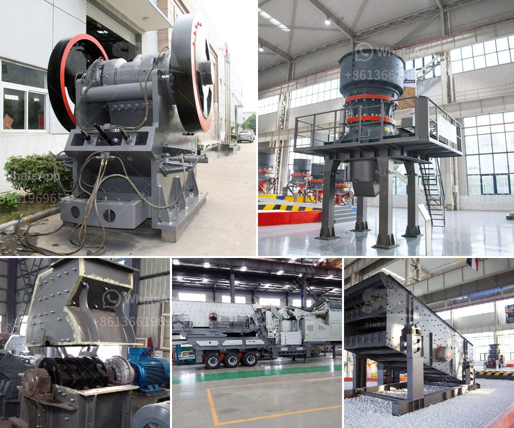

<h3>harga pe jc jaw crusher dan harga</h3>
Jaw crushers are widely used in the mining and construction industry as they provide efficient and versatile crushing capabilities. With a diverse range of models available, customers can choose the one that best suits their specific needs. Two popular options are the PE and JC jaw crushers, each offering their own unique advantages. In this article, we will explore the harga (price) range of these crushers, providing potential buyers with valuable information to make an informed purchasing decision.

The PE jaw crusher, also known as the traditional jaw crusher, is widely used in primary crushing applications. It is known for its simplicity, durability, and affordability. The harga range for PE jaw crushers can vary between thousands to tens of thousands of dollars. This price range is determined by various factors, such as capacity, size, and production requirements. However, even at the lower end of the price range, the PE jaw crusher delivers reliable performance and can handle various materials efficiently.

On the other hand, the JC jaw crusher is a more advanced crushing machine compared to the PE model. It incorporates innovative technology and design elements, resulting in improved productivity and reduced maintenance costs. The harga range for JC jaw crushers can be higher, starting from tens of thousands of dollars and potentially reaching hundreds of thousands. The increased price is justified by the enhanced features and overall performance offered by this model.

When considering the harga of these jaw crushers, it is essential to evaluate the specific requirements and budget constraints. The PE jaw crusher provides an economical option for customers with lower production needs or limited budget. It still guarantees adequate crushing power and reliability. On the other hand, the JC jaw crusher offers advanced features and higher capacity for those who require faster and more efficient crushing capabilities. The increased investment is justified for businesses with higher production volumes or more demanding applications.

To conclude, when exploring the harga range of PE JC jaw crushers, it is crucial to assess the production requirements and budget constraints. The PE jaw crusher offers affordability and reliability, making it an attractive option for customers with lower production needs. On the other hand, the JC jaw crusher provides advanced features and improved performance, suitable for businesses with higher demands. Ultimately, the choice between the two models should be based on the specific requirements and available budget.
<h3>Contact us</h3><ul><li><strong>Whatsapp:&nbsp;<a href="https://wa.me/8613661969651">+8613661969651</a></strong></li><li><a href="https://swt.shibang-china.com/?git&amp;zhl&amp;harga pe jc jaw crusher dan harga"><strong>Online Service(chat now)</strong></a></li></ul><h3>Related</h3><ul><li><a href='cost of cone crusher.md'>cost of cone crusher</a></li><li><a href='ethiopia gypsum machinery supplier.md'>ethiopia gypsum machinery supplier</a></li><li><a href='types of vibratory screens.md'>types of vibratory screens</a></li><li><a href='fly ash introduction in cement ball mill.md'>fly ash introduction in cement ball mill</a></li><li><a href='ball mills as size reduction equipment.md'>ball mills as size reduction equipment</a></li></ul>