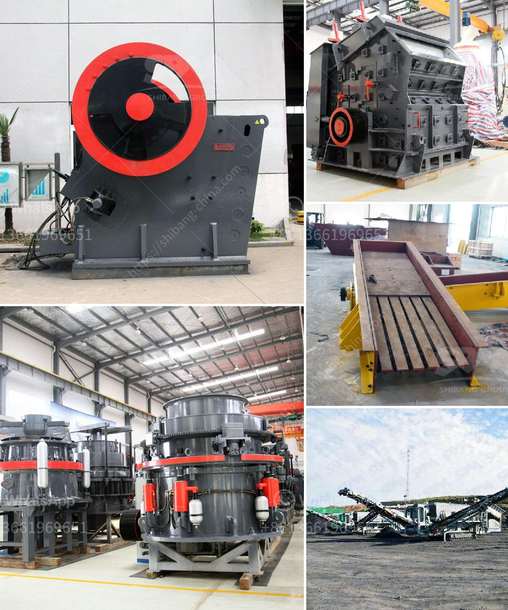

<h3>harga sewa beli stone crusher kapasitas 30 ton per jam</h3>
Stone crusher merupakan alat yang digunakan untuk menghancurkan batuan besar menjadi beberapa bagian kecil. Batu tersebut biaa digunakan untuk keperluan bangunan, jalan, konstruksi, dan sebagainya. Salah satu jenis stone crusher yang umum digunakan adalah stone crusher kapasitas 30 ton per jam.

Stone crusher kapasitas 30 ton per jam dapat digunakan untuk menghancurkan berbagai macam batu. Biaa, batu yang berukuran besar menjadi batu pecahan yang lebih kecil seperti kerikil. Stone crusher ini memiliki kapasitas yang cukup tinggi, yaitu sekitar 30 ton per jam.

Harga sewa beli stone crusher kapasitas 30 ton per jam juga tergantung pada ukuran produk yang dihasilkan, mulai dari batu pecahan yang biasa digunakan untuk material bangunan, hingga batu ukuran besar yang sampai harus melalui proses saringan. Semakin besar ukuran hasil produksi yang diinginkan, semakin tinggi pula harga stone crusher ini.

Selain itu, harga sewa beli stone crusher kapasitas 30 ton per jam juga dipengaruhi oleh lokasi proyek. Jika lokasi proyek berada di dekat area pemrosesan batu, harga sewa beli stone crusher bisa lebih rendah karena biaya operasional yang lebih murah. Namun, jika lokasi proyek berada di daerah terpencil atau sulit dijangkau, harga stone crusher pun bisa lebih tinggi karena biaya transportasi yang lebih mahal.

Stone crusher kapasitas 30 ton per jam juga memiliki kelebihan dalam segi efisiensi dan produktivitas. Mesin ini dilengkapi dengan sistem pengumpan otomatis, yang memungkinkan material batu masuk ke dalam mesin secara terus menerus. Hal ini meminimalisir waktu tunggu dalam proses pemecahan batu, sehingga meningkatkan efisiensi kerja pada proyek.

Tentu saja, dalam menggunakan stone crusher kapasitas 30 ton per jam, perlu mempertimbangkan juga aspek keamanan dan kesehatan kerja. Operator mesin perlu dilengkapi dengan peralatan keselamatan, seperti helm, sarung tangan, dan sepatu keselamatan. Pemeliharaan rutin dan perawatan juga harus dilakukan agar mesin tetap berfungsi dengan baik dan aman digunakan.

Dalam membeli stone crusher kapasitas 30 ton per jam, ada beberapa hal yang perlu diperhatikan. Pastikan mesin yang dibeli memiliki sertifikat mutu dan telah teruji kualitasnya. Jangan terlalu tergiur dengan harga yang terlalu murah, karena bisa jadi kualitas mesinnya tidak optimal. Selain itu, pastikan juga ada jaminan atau garansi dari penjual terkait dengan kerusakan atau kerusakan yang mungkin terjadi pada mesin.

Dalam proses sewa beli stone crusher kapasitas 30 ton per jam ini, penting untuk melakukan perencanaan yang matang dan terpenuhinya kebutuhan proyek. Pastikan kebutuhan material batu terpenuhi dengan baik dan sesuai dengan spesifikasi yang diharapkan.

Dalam artikel ini, telah dijelaskan mengenai harga sewa beli stone crusher kapasitas 30 ton per jam. Mesin ini memungkinkan untuk menghancurkan berbagai macam batuan menjadi ukuran yang diinginkan. Dalam membeli stone crusher, diperlukan perhatian yang matang terhadap aspek keamanan dan kualitas mesin. Semoga informasi ini bermanfaat bagi Anda yang membutuhkan stone crusher kapasitas 30 ton per jam.
<h3>Contact us</h3><ul><li><strong>Whatsapp:&nbsp;<a href="https://wa.me/8613661969651">+8613661969651</a></strong></li><li><a href="https://swt.shibang-china.com/?git&amp;zhl&amp;harga sewa beli stone crusher kapasitas 30 ton per jam"><strong>Online Service(chat now)</strong></a></li></ul><h3>Related</h3><ul><li><a href='mobile sand making machine.md'>mobile sand making machine</a></li><li><a href='alluvial gold mining in zimbabwe.md'>alluvial gold mining in zimbabwe</a></li><li><a href='how much crusher plant cost.md'>how much crusher plant cost</a></li><li><a href='the roller grinding mill.md'>the roller grinding mill</a></li><li><a href='mobile crusher alkatrate.md'>mobile crusher alkatrate</a></li></ul>