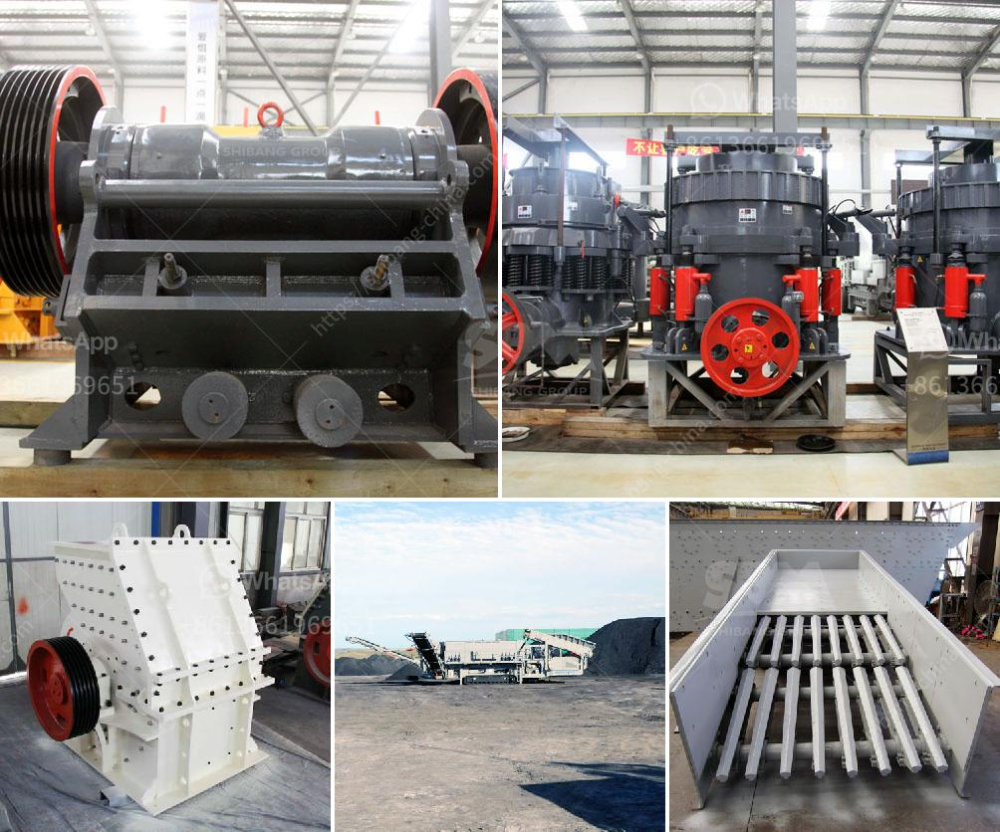

<h3>harga vibrating screen</h3>
A vibrating screen is often used in mining operations to separate materials into various sizes for further processing or for end use. Harga vibrating screen, also known as vibrating screen price, is an essential piece of equipment in the mining industry, as it helps separate the valuable minerals from the waste materials.

The primary function of a vibrating screen is to separate the feed material into different sizes. This is achieved by using a series of screens with different-sized openings. The larger-sized openings allow the larger particles to pass through, while the smaller ones are retained on the screen surface.

One of the critical factors that determine the efficiency of a vibrating screen is the screen size or mesh opening. The screen size can vary depending on the application and the desired end product. For example, in a mining operation, a larger-sized screen opening may be used to separate the ore from the waste material. On the other hand, in construction or aggregate industries, a smaller-sized screen opening may be used to produce specific sizes of aggregates or crushed stones.

The harga vibrating screen refers to the price of the vibrating screen equipment. It is an important factor to consider when purchasing a vibrating screen, as it determines the potential return on investment. The harga vibrating screen can vary depending on the specifications and features of the equipment. Higher-priced vibrating screens may have advanced features such as touch screens, automated controls, or higher-quality materials.

In mining operations, the harga vibrating screen is crucial for maximizing productivity and profitability. The vibrating screen helps remove the oversize and undersize particles, ensuring that only the desired particles are sent to further processing or for end use. By separating the valuable minerals from the waste material, the vibrating screen helps improve the overall efficiency of the mining operation.

Furthermore, the harga vibrating screen also affects the overall cost of operation and maintenance. Higher-priced vibrating screens may come with additional features or higher-quality components, resulting in lower maintenance and replacement costs over time. Investing in a higher-priced vibrating screen can often lead to long-term cost savings and improved durability.

It is also worth mentioning that the harga vibrating screen is not the only factor to consider when purchasing a vibrating screen. Other factors such as the capacity, power requirements, and the type of material to be processed should also be taken into account. It is essential to select a vibrating screen that is suitable for the specific application to achieve optimal performance and efficiency.

In conclusion, the harga vibrating screen is an important consideration when purchasing vibrating screen equipment in the mining industry. It reflects the potential return on investment and influences the overall efficiency, productivity, and cost of operation. By investing in a high-quality vibrating screen with the appropriate screen size and features, mining operations can achieve higher productivity, better product quality, and significant cost savings over time.
<h3>Contact us</h3><ul><li><strong>Whatsapp:&nbsp;<a href="https://wa.me/8613661969651">+8613661969651</a></strong></li><li><a href="https://swt.shibang-china.com/?git&amp;zhl&amp;harga vibrating screen"><strong>Online Service(chat now)</strong></a></li></ul><h3>Related</h3><ul><li><a href='500mm vertical mill stones price.md'>500mm vertical mill stones price</a></li><li><a href='iron ore beneficiation process in mexico.md'>iron ore beneficiation process in mexico</a></li><li><a href='hard rock crushers manufacturers india.md'>hard rock crushers manufacturers india</a></li><li><a href='continuous ball mill capacity 500 hr.md'>continuous ball mill capacity 500 hr</a></li><li><a href='micro mill grinding mills.md'>micro mill grinding mills</a></li></ul>