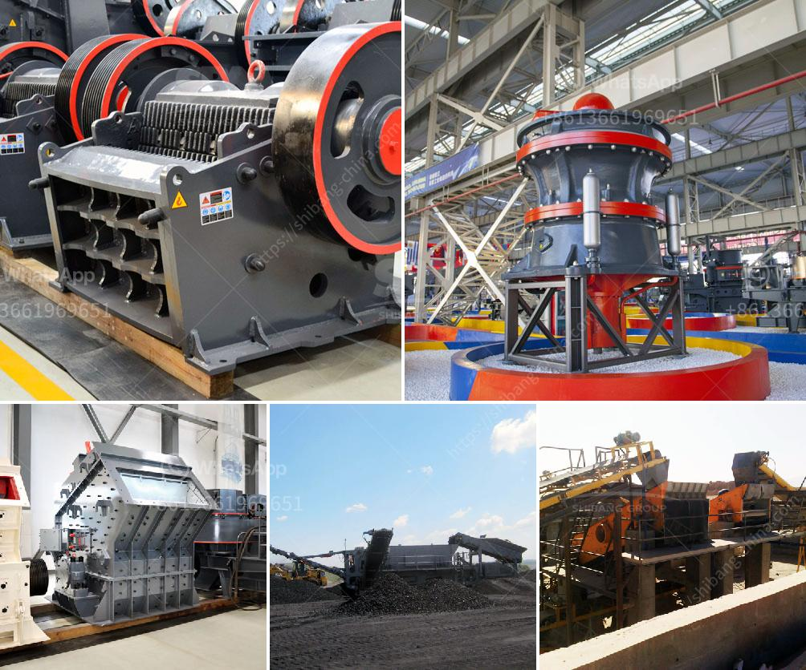

<h3>high efficiency 200tph jaw crusher with great price</h3>
The crushing industry plays a crucial role in various industrial sectors that include mining, construction, and infrastructure projects. Traditional crushing equipment has often been deemed inefficient, leading to higher costs and time-consuming processes. However, a new breed of jaw crushers has emerged, revolutionizing the industry. Among them, the high-efficiency 200tph jaw crusher with a great price stands out as a game-changer in terms of crushing efficiency, reduced operational costs, and enhanced productivity.

The high-efficiency 200tph jaw crusher melds cutting-edge technology with a unique design, resulting in a robust and reliable crusher. Its compact structure ensures easy installation and maintenance, while its state-of-the-art hydraulic system optimizes the crushing process by adjusting the discharge opening and cavity design.

With a jaw crusher of this caliber, companies can crush large quantities of hard materials effortlessly. The 200tph capacity allows for an efficient processing of vast amounts of aggregate, minerals, or other ores, enabling businesses to meet high demand levels promptly.

Combining an advanced motor and optimized crushing chamber design, this jaw crusher effectively minimizes energy consumption. The high crushing ratio and superior performance guarantee an efficient and cost-effective operation, making it an environmentally friendly choice.

One of the key advantages of the high-efficiency 200tph jaw crusher is its versatility. Various materials, such as granite, basalt, limestone, concrete, and more, can be processed efficiently. This versatility enables the crusher to be used across industries, maximizing its utility and investment returns for businesses.

The incorporation of an intelligent control system allows operators to monitor and control the crusher's performance in real-time. The system provides comprehensive data on operational statuses, maintenance requirements, and even predicts possible failures, ensuring smooth and uninterrupted crushing operations.

The high-efficiency 200tph jaw crusher boasts several features that contribute to lowered operational costs. The advanced crushing chamber design optimizes material throughput, reducing wear and tear on the jaws. Additionally, the high-efficiency motor minimizes energy consumption, resulting in significant cost savings over time.

The 200tph jaw crusher is built to withstand the toughest operating conditions, ensuring its longevity and reliability. Engineered with durable materials and precision engineering, this crusher has been rigorously tested to meet the highest industry standards. Its ability to work continuously without breakdowns or interruptions gives businesses peace of mind and enhances overall productivity.

The introduction of the high-efficiency 200tph jaw crusher to the crushing market has brought about a paradigm shift in the industry. Its innovative design, advanced technology, and cost-effective benefits have made it a top-choice solution for companies in need of high-performance crushing equipment. By improving efficiency, reducing operational costs, and maximizing productivity, this jaw crusher is revolutionizing the way materials are processed, setting new benchmarks for the entire crushing industry.
<h3>Contact us</h3><ul><li><strong>Whatsapp:&nbsp;<a href="https://wa.me/8613661969651">+8613661969651</a></strong></li><li><a href="https://swt.shibang-china.com/?git&amp;zhl&amp;high efficiency 200tph jaw crusher with great price"><strong>Online Service(chat now)</strong></a></li></ul><h3>Related</h3><ul><li><a href='coal washing equipment.md'>coal washing equipment</a></li><li><a href='crusher machine price list.md'>crusher machine price list</a></li><li><a href='mining plant for sale harare zimbabwe.md'>mining plant for sale harare zimbabwe</a></li><li><a href='silica sand crusher in turkey.md'>silica sand crusher in turkey</a></li><li><a href='conventional stone crushers in peru.md'>conventional stone crushers in peru</a></li></ul>