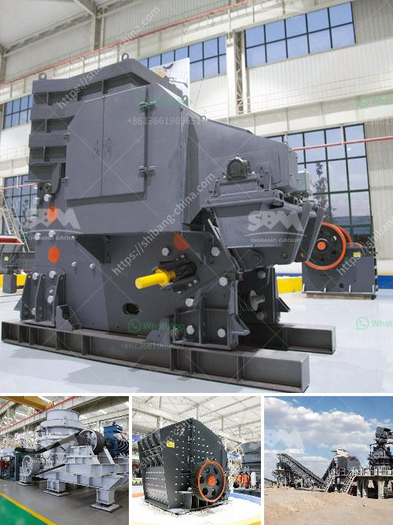

<h3>hot sale and low cost mobile crushing plant</h3>
A mobile crushing plant refers to a portable crushing station that plays a vital role in the construction waste disposal industry. It enables the efficient disposal of construction waste, ensuring its safe and environmentally friendly handling. With the increasing demand for construction materials and the growing concern for the environment, the mobile crushing plant has become a crucial tool for many construction companies.

The hot sale and low-cost mobile crushing plant is equipped with the advanced technology and powerful machinery needed to efficiently process various types of materials. It can crush stones, concrete, or demolition waste with high efficiency. Moreover, the mobile crushing plant can be customized to meet the specific requirements of different construction projects.

One of the main advantages of using a mobile crushing plant is its cost-effectiveness. Compared to traditional crushing plants, mobile crushers require significantly less space and eliminate the need for costly transportation of raw materials. This, in turn, reduces the overall cost of the project. Additionally, the mobile crushing plant operates on a diesel-electric hybrid engine, which reduces fuel consumption and minimizes pollution.

The versatility of the mobile crushing plant is another key feature. It can be easily transported to the construction site, allowing for on-site crushing and recycling. This eliminates the need to haul materials to a processing plant and reduces transportation costs. Furthermore, the mobile crushing plant can be used in various construction applications, including road construction, building demolition, and infrastructure development.

In conclusion, the hot sale and low-cost mobile crushing plant is an essential tool for the disposal of construction waste. Its cost-effectiveness, versatility, and environmentally friendly features make it a preferred choice for many construction companies. Considering the increasing demand for construction materials and the need for sustainable waste management, investing in a mobile crushing plant becomes a wise and lucrative decision.
<h3>Contact us</h3><ul><li><strong>Whatsapp:&nbsp;<a href="https://wa.me/8613661969651">+8613661969651</a></strong></li><li><a href="https://swt.shibang-china.com/?git&amp;zhl&amp;hot sale and low cost mobile crushing plant"><strong>Online Service(chat now)</strong></a></li></ul><h3>Related</h3><ul><li><a href='magnetic separator manufacturers in turkey.md'>magnetic separator manufacturers in turkey</a></li><li><a href='hammer mill sales in zimbabwe.md'>hammer mill sales in zimbabwe</a></li><li><a href='crawler type mobile crusher plant.md'>crawler type mobile crusher plant</a></li><li><a href='ball mills zenith china.md'>ball mills zenith china</a></li><li><a href='cone crusher for salae used.md'>cone crusher for salae used</a></li></ul>