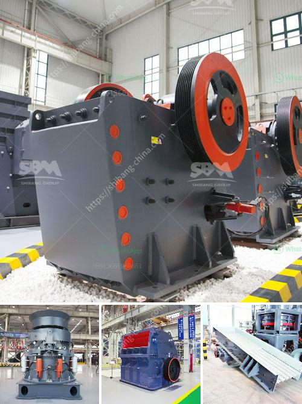

<h3>how much capital needed to start a midium cement factory</h3>
The cement industry plays a pivotal role in infrastructure development, making it a lucrative venture for potential entrepreneurs. However, establishing a medium-sized cement factory entails substantial upfront capital investment, considering the intricacies involved in the manufacturing process. This article aims to shed light on the estimated capital required to set up such a venture.

Before diving into the finances, conducting a comprehensive feasibility study is paramount. This study allows potential investors to evaluate various factors such as market demand, raw material availability, competition, and potential risks, ensuring the project's viability. Once the feasibility is established, the planning stage commences, wherein decisions about location, machinery procurement, labor requirements, and infrastructure development are finalized.

The capital needed to establish a medium-sized cement factory can be broken down into the following major components:

1. Land and Building: Acquiring an appropriate land parcel and constructing the factory building incurs a substantial share of the total project cost.

2. Machinery and Equipment: The core machinery required for cement manufacturing includes crushers, kilns, mills, coolers, conveyors, and packing machines. These machinery and equipment make up a significant portion of the capital required.

3. Raw Materials: Procuring quality limestone, clay, gypsum, and other materials necessary for cement production must be factored into the capital estimate. A cement factory typically requires a nearby source of limestone, impacting the transportation cost.

4. Infrastructure and Utilities: Developing necessary infrastructure such as roads, drainage systems, water storage, power supply arrangements, and wastewater treatment facilities contribute to the capital requirements.

5. Working Capital: To ensure a smooth operation and cover initial expenses, working capital is necessary. It comprises funds to pay for salaries, raw materials, utility bills, marketing, and other miscellaneous expenses during the initial period.

While the minimum capital required to establish a medium-sized cement factory can vary based on multiple factors, an estimated figure lies within the range of $50 to $100 million. However, it is essential to note that conducting an in-depth feasibility analysis and seeking professional advice from industry experts and financial institutions are imperative to obtain accurate estimates and a comprehensive financial plan for the venture's success. With sound planning, diligent research, and adequate financial backing, establishing a medium-sized cement factory can be a rewarding investment opportunity.
<h3>Contact us</h3><ul><li><strong>Whatsapp:&nbsp;<a href="https://wa.me/8613661969651">+8613661969651</a></strong></li><li><a href="https://swt.shibang-china.com/?git&amp;zhl&amp;how much capital needed to start a midium cement factory"><strong>Online Service(chat now)</strong></a></li></ul><h3>Related</h3><ul><li><a href='stone processing equipment in south africa.md'>stone processing equipment in south africa</a></li><li><a href='used raymond mill for sale in taiwan crusher.md'>used raymond mill for sale in taiwan crusher</a></li><li><a href='jaw crushers prices in zimbabwe.md'>jaw crushers prices in zimbabwe</a></li><li><a href='jaw crusher process description.md'>jaw crusher process description</a></li><li><a href='thailand granite quarry crusher.md'>thailand granite quarry crusher</a></li></ul>