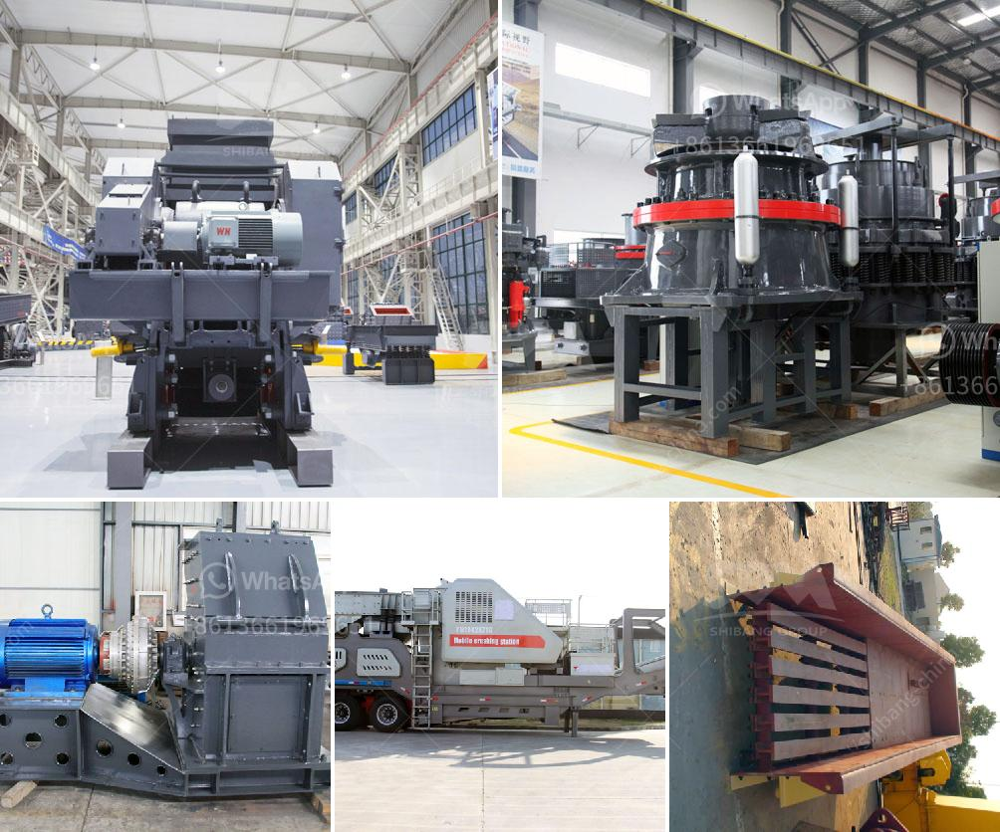

<h3>how much complete cost for iron ore crasher plants setup</h3>
The iron ore crushing plant is an important part of the mining industry. It is used to create steel and is the raw material for many other industries. The cost of setting up a crusher plant can vary depending on the ore density, moisture content, location, and other factors.

In today's challenging economic climate, mining companies are looking for ways to enhance their competitive advantage and increase profitability. Setting up a crushing plant is one way to enhance efficiency and maintain production targets. However, it is vital to have a clear understanding of the costs associated with establishing a new facility.

Firstly, it is essential to determine the availability of the iron ore resource. This includes conducting thorough exploration activities to estimate the quantity and quality of the deposit. Once these parameters are defined, the next step is to determine the plant's required capacity.

The capacity of the crusher plant will depend on the grade and hardness of the ore, as well as the size distribution of the ore particles. To minimize production downtime, it is crucial to select a crusher with the appropriate capacity and capabilities. This should be done after careful consideration and consultation with experts in the field.

Apart from the crusher itself, other essential equipment includes vibrating feeders, screens, conveyors, and control systems. Each piece of equipment contributes to the efficiency and productivity of the plant. While the cost of individual components can vary, it is important to choose high-quality equipment that will ensure optimum performance and longevity.

Infrastructure costs associated with the setup are also critical factors to consider. These include site preparation, civil works, electrical connections, and water supply. Depending on the location, these costs can vary significantly.

Moreover, ongoing operational costs, such as maintenance, repairs, and replacement of worn-out parts, must be factored into the overall budget. It is recommended to establish a comprehensive maintenance plan to minimize downtime and maximize the lifespan of the equipment.

Furthermore, labor costs play a significant role in the overall cost of setting up and operating an iron ore crusher plant. Skilled and experienced operators are crucial to ensuring efficient and safe operations. Additionally, hiring support staff for various administrative and logistical tasks is necessary.

Legal and regulatory compliance is also essential to avoid penalties and fines. Obtaining the required permits and environmental clearances may involve additional costs, but compliance ensures sustainability and responsible mining practices.

The cost of setting up an iron ore crusher plant can range from hundreds of thousands to millions of dollars. It is important to determine the project's budget and carefully plan the execution to ensure the desired outcomes are achieved without compromising safety, environmental considerations, and profitability.

In conclusion, setting up an iron ore crusher plant requires careful consideration of the several factors impacting the project cost. A comprehensive cost analysis that includes exploration expenses, equipment costs, infrastructure development, operational and maintenance expenses, labor costs, and legal fees should be conducted to ensure a successful and profitable operation. By understanding the project's budget, mining companies can make informed decisions and achieve their production targets while remaining cost-effective.
<h3>Contact us</h3><ul><li><strong>Whatsapp:&nbsp;<a href="https://wa.me/8613661969651">+8613661969651</a></strong></li><li><a href="https://swt.shibang-china.com/?git&amp;zhl&amp;how much complete cost for iron ore crasher plants setup"><strong>Online Service(chat now)</strong></a></li></ul><h3>Related</h3><ul><li><a href='stone crushing plant manufacturers.md'>stone crushing plant manufacturers</a></li><li><a href='500 tph jaw crusher for sale.md'>500 tph jaw crusher for sale</a></li><li><a href='material composition for coal screen.md'>material composition for coal screen</a></li><li><a href='coal washing equipment.md'>coal washing equipment</a></li><li><a href='crusher machines for granite in nigeria.md'>crusher machines for granite in nigeria</a></li></ul>