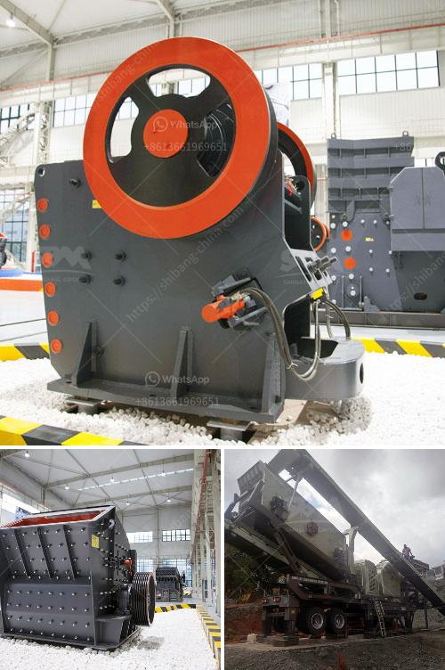

<h3>how much crusher plant cost</h3>
A crusher plant, also known as a crushing plant, is a machine designed to crush various types of rocks into smaller pieces. It is used in a variety of industries, including mining, construction, metallurgy, and chemical engineering. In recent years, the demand for crushers has increased due to the rapid growth in infrastructure development projects around the world.

When considering the cost of a crusher plant, several factors need to be taken into account. The first and most important factor is the type and model of the plant. Different models have different capacities and features, which directly affect the cost. Additionally, the size and type of the input material and the desired output size also play a crucial role in determining the cost.

The cost of a crusher plant also depends on various other factors such as location, working conditions, and infrastructure. The prices of different types of equipment vary depending on the brand, quality, and country of origin. The lifespan of the infrastructure and equipment also significantly affects the overall cost of the plant.

Typically, the cost of a crusher plant ranges from around $150,000 to $1 million USD. However, the final cost will depend on the type of plant you require and the features that come with it. Once you have decided on the specific model and features, it is advisable to get multiple quotes from different suppliers to compare prices and make an informed decision.

Crusher plants are an essential investment for any construction or mining company. They provide the necessary materials for building roads, bridges, and buildings, as well as for the production of concrete and asphalt. While the initial cost of setting up a crusher plant may seem high, the long-term benefits outweigh the price.

In conclusion, the cost of a crusher plant can vary significantly depending on the size, capacity, and features of the plant, as well as other factors such as location and working conditions. It is crucial to carefully evaluate your needs and budget before making a purchase. By doing so, you can ensure that you are getting the best value for your investment and that your crusher plant will meet your specific requirements for years to come.
<h3>Contact us</h3><ul><li><strong>Whatsapp:&nbsp;<a href="https://wa.me/8613661969651">+8613661969651</a></strong></li><li><a href="https://swt.shibang-china.com/?git&amp;zhl&amp;how much crusher plant cost"><strong>Online Service(chat now)</strong></a></li></ul><h3>Related</h3><ul><li><a href='used crushers for sale in usa.md'>used crushers for sale in usa</a></li><li><a href='jaw crusher mobile.md'>jaw crusher mobile</a></li><li><a href='100tph stone crusher plant.md'>100tph stone crusher plant</a></li><li><a href='stone crusher in cameroon.md'>stone crusher in cameroon</a></li><li><a href='georgia cement mini plant.md'>georgia cement mini plant</a></li></ul>