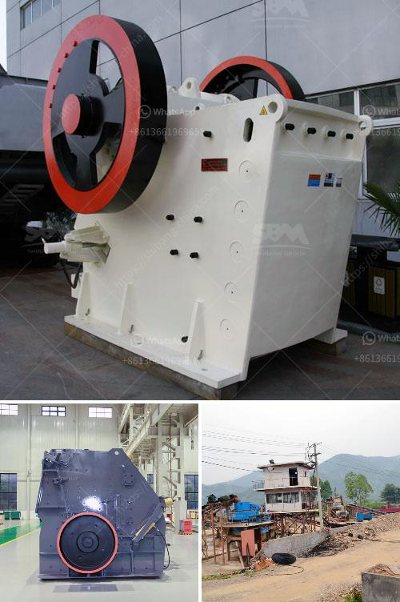

<h3>how much does a crusher</h3>
A crusher is a machine that breaks down materials into smaller pieces. It is commonly used in industries such as construction, mining, and recycling. The size of the crusher will depend on the material being crushed and the desired output size.

The cost of a crusher can vary greatly depending on the size and capacity. A small crusher can cost as little as a few thousand dollars, while a larger crusher may cost several hundred thousand dollars. These costs will also depend on additional features and accessories that may be added to the crusher.

In addition to the initial cost of the crusher, there are also operating costs to consider. This includes the cost of electricity to power the machine, as well as regular maintenance and repairs. The type of material being crushed can also affect operating costs, as harder materials may require more energy and wear down the machine at a faster rate.

When selecting a crusher, it is important to consider not only the cost, but also the efficiency and durability of the machine. A high-quality crusher may have a higher upfront cost, but it can provide greater productivity and require fewer repairs over time.

In conclusion, the cost of a crusher can vary depending on factors such as size, capacity, and additional features. It is important to consider both the upfront cost and the long-term operating costs when choosing a crusher for your specific needs. By selecting a high-quality and efficient machine, you can maximize productivity and minimize expenses in the long run.
<h3>Contact us</h3><ul><li><strong>Whatsapp:&nbsp;<a href="https://wa.me/8613661969651">+8613661969651</a></strong></li><li><a href="https://swt.shibang-china.com/?git&amp;zhl&amp;how much does a crusher"><strong>Online Service(chat now)</strong></a></li></ul><h3>Related</h3><ul><li><a href='mining equipment companies in nigeria.md'>mining equipment companies in nigeria</a></li><li><a href='sand sieving machine by vibrating system chennai.md'>sand sieving machine by vibrating system chennai</a></li><li><a href='river sand garnet processing machines.md'>river sand garnet processing machines</a></li><li><a href='sri lanka sand washing machine prices.md'>sri lanka sand washing machine prices</a></li><li><a href='7 in x 8 in hammer mill gold quarz.md'>7 in x 8 in hammer mill gold quarz</a></li></ul>