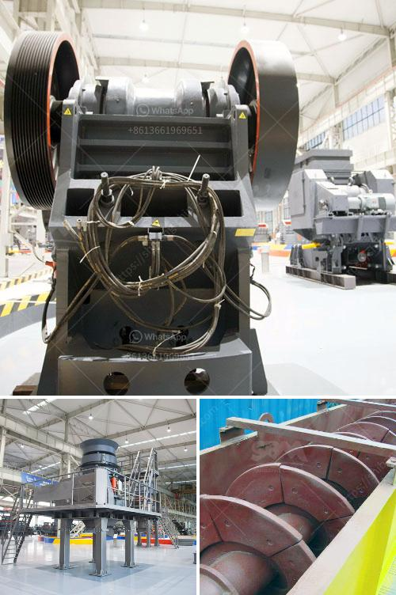

<h3>how much does it cost to build a slag processing plant</h3>
In recent years, the demand for sustainable industrial practices has grown rapidly worldwide. This trend has strengthened the existence and relevance of slag processing plants, which play a pivotal role in recycling industrial waste and conserving natural resources. In this article, we will explore the essential cost factors associated with constructing a slag processing plant.

The first significant cost component in building a slag processing plant is acquiring land suitable for the facility. The location should ideally have enough space for the plant itself, stockpiles, and adequate access for transportation. The cost of land acquisition can vary significantly depending on the region and market conditions.

To ensure optimal efficiency and productivity, thorough planning and engineering design are crucial. Expert engineers and consultants are hired to develop tailored solutions for the plant's requirements. The associated costs cover project management, feasibility studies, architectural design, structural engineering, electrical systems, and permits. These expenses can vary based on the complexity and size of the plant.

A slag processing plant requires a range of specialized equipment to handle the various stages of processing slag. Typically, these include crushers, screens, magnetic separators, conveyors, and storage facilities. The specific equipment needs will depend on factors such as the type of slag being processed, its volume, and the desired end product. The cost of purchasing quality machinery can be a significant portion of the overall project budget.

Skilled labor, construction materials, and site preparation are crucial during the construction phase. The cost includes civil works, foundations, steel structure installation, utilities, and the provision of necessary safety equipment. The size and complexity of the plant, as well as local labor costs, will influence the expenses involved in constructing and installing the facility.

A slag processing plant must meet stringent environmental regulations to ensure the safe and responsible handling of waste materials. Costs associated with this aspect include obtaining environmental permits, implementing pollution control measures, and adhering to air and water quality standards. Implementing suitable waste management practices is vital to minimize the environmental impact and avoid any potential fines or penalties.

Operating and maintaining a slag processing plant involves ongoing costs such as labor, power consumption, consumables, maintenance of machinery, and general upkeep. Proper training of personnel and regular inspections are essential to optimize the plant's performance, minimize downtime, and extend the lifespan of equipment.

Constructing a slag processing plant involves a wide range of cost factors, including land acquisition, plant design, equipment and machinery purchasing, construction and installation, environmental compliance, and ongoing operation and maintenance expenses. The actual budget will vary depending on the specific plant requirements, location, size, and environmental regulations. By carefully assessing and planning for each cost component, organizations can construct a cost-effective slag processing plant that efficiently converts waste into valuable resources while promoting sustainable industrial practices.
<h3>Contact us</h3><ul><li><strong>Whatsapp:&nbsp;<a href="https://wa.me/8613661969651">+8613661969651</a></strong></li><li><a href="https://swt.shibang-china.com/?git&amp;zhl&amp;how much does it cost to build a slag processing plant"><strong>Online Service(chat now)</strong></a></li></ul><h3>Related</h3><ul><li><a href='sayaji stone crusher machine.md'>sayaji stone crusher machine</a></li><li><a href='dry process of cement.md'>dry process of cement</a></li><li><a href='jaw crusher for chrome ore for sale.md'>jaw crusher for chrome ore for sale</a></li><li><a href='crusher plant project cost.md'>crusher plant project cost</a></li><li><a href='small mobile wash plants for sale.md'>small mobile wash plants for sale</a></li></ul>