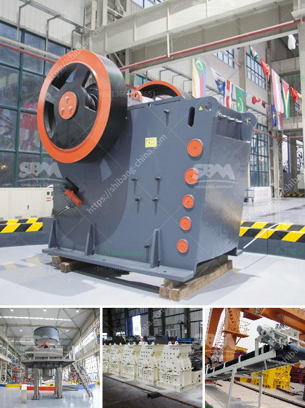

<h3>how much in bauxite crushing plant</h3>
The extraction of bauxite, the primary ore used for aluminum production, requires a significant investment in crushing plants. These plants serve to process bauxite into specific sizes needed for the production of aluminum, making them crucial for the mining industry. In this article, we will explore the underlying factors and costs associated with setting up a bauxite crushing plant.

The location of the crushing plant plays a vital role in determining the overall investment costs. Proximity to the bauxite deposits ensures lower transportation costs, optimizing the overall budget. Additionally, accessibility to necessary services, such as water and electricity, should be considered to minimize operational costs.

The desired capacity of the bauxite crushing plant determines the overall cost. Larger plants require more machinery, energy, and maintenance to operate efficiently. Therefore, estimating the annual output and future production requirements is crucial in determining the plant's capacity.

A primary component of bauxite crushing plants is the machinery involved in the process. This includes crushers, screens, conveyors, and auxiliary equipment. The selection of appropriate machinery should consider factors such as efficiency, durability, and maintenance requirements, all of which can impact the plant's cost.

The number of workers required to operate the crushing plant significantly contributes to the overall cost. Skilled labor, including engineers, technicians, and maintenance personnel, plays a vital role in maintaining plant efficiency and reducing downtime. Thus, estimating manpower requirements is essential in budgeting for labor and operational costs.

Compliance with environmental regulations contributes to the overall cost of the bauxite crushing plant. Factoring in costs related to obtaining permits, conducting environmental impact assessments, and implementing pollution control measures are vital to ensure sustainability and adhere to legal obligations.

Regular maintenance and ongoing operational costs are necessary for the smooth operation of a bauxite crushing plant. As equipment ages and faces wear and tear, periodic repairs and replacement of components become necessary. Proactive maintenance practices reduce downtime and ensure uninterrupted production.

Implementing proper safety measures to protect workers from potential hazards is an integral part of any crushing plant's cost estimation. Equipment safety features, employee training, and safety protocols should be considered to comply with regulations and promote a safe working environment.

The investment in a bauxite crushing plant involves considering various factors that impact the overall cost. Location, plant capacity, machinery and equipment, labor, regulatory compliance, maintenance, and safety-related expenses all contribute to the financial outlay. A comprehensive understanding of these factors ensures that the crushing plant meets production requirements efficiently while being sustainable, safe, and compliant. By acknowledging these factors, mining companies can make informed decisions about the investment required for their bauxite crushing plants.
<h3>Contact us</h3><ul><li><strong>Whatsapp:&nbsp;<a href="https://wa.me/8613661969651">+8613661969651</a></strong></li><li><a href="https://swt.shibang-china.com/?git&amp;zhl&amp;how much in bauxite crushing plant"><strong>Online Service(chat now)</strong></a></li></ul><h3>Related</h3><ul><li><a href='cement clinker grinding ball mill manufacturer india.md'>cement clinker grinding ball mill manufacturer india</a></li><li><a href='calcium carbonate crusher.md'>calcium carbonate crusher</a></li><li><a href='impact crushers supply.md'>impact crushers supply</a></li><li><a href='slag crushing machine hopper in india.md'>slag crushing machine hopper in india</a></li><li><a href='lime stone crusher in south africa.md'>lime stone crusher in south africa</a></li></ul>