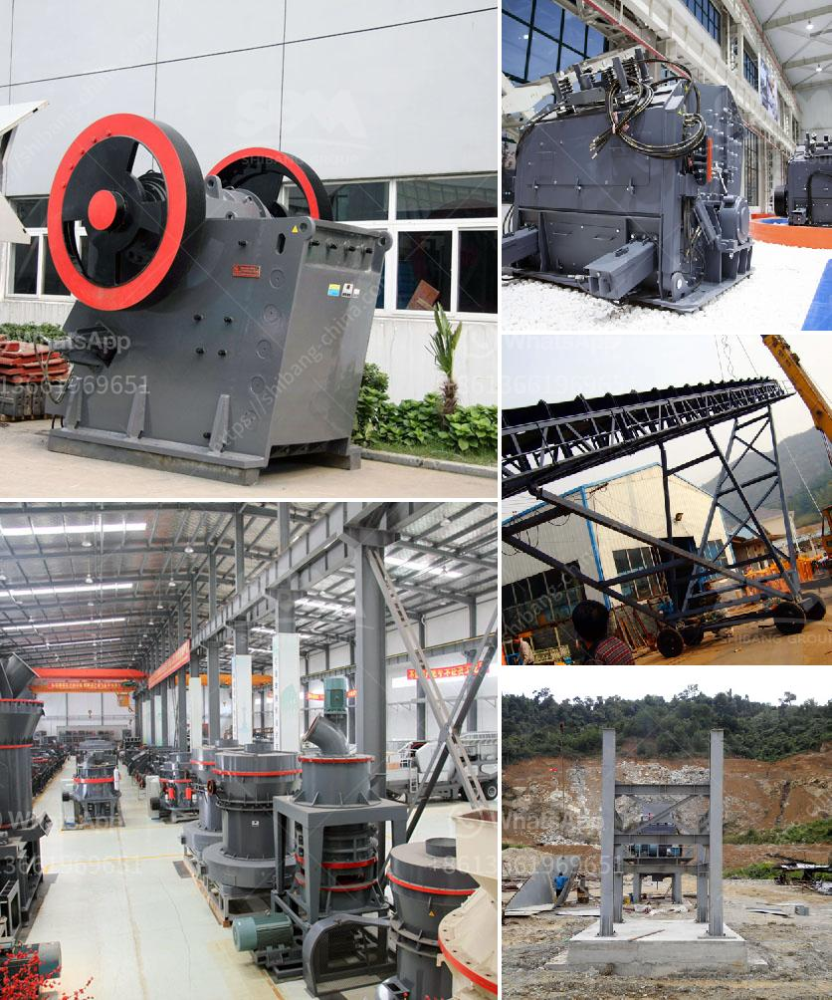

<h3>how much would it cost to start a gravel quarry</h3>
Starting a gravel quarry is a rewarding venture for those in the construction industry. With millions of people creating infrastructure and shelter every year, there is always a demand for sand, stone, and gravel materials. If you're interested in starting a gravel quarry, the following information will assist you in estimating the cost of your endeavor.

Stones extraction and gravel production contribute significantly to the local economy. Moreover, they provide resources for construction projects and infrastructure development, making them essential for any community. However, starting a gravel quarry is not a task for the faint-hearted. It requires substantial funding as well as planning and dedication. The cost of this venture depends on several factors, some of which are outlined below.

When starting a gravel quarry, the location of the site will have an impact on your cost. The closer you are to the market, the lower the transportation costs will be. Conversely, if your quarry is far from these areas, you will need to factor in additional expenses involved in transporting materials. Additionally, the cost of acquiring land will vary based on the location and size of the quarry. This initial investment can be quite substantial.

Purchasing equipment for a gravel quarry can be expensive. You'll need loaders, trucks, crushers, screens, and conveyors, among other machinery. Depending on the size of your operation, the cost of these machines can range from thousands to millions of dollars. However, if you cannot afford to purchase new equipment, you may consider leasing or renting options.

Before starting any quarry operation, you will need permits and licenses from local authorities. The requirements for obtaining these documents can vary depending on your location. It's recommended to consult with professionals who are familiar with the legal framework and regulations governing quarries in your area. This may include environmental assessments, land use permits, and health and safety compliance, among others. It's essential to budget for the costs associated with obtaining these permits to ensure your operation is legal and sustainable.

Once your quarry is up and running, you need to account for ongoing operational and maintenance costs. This includes fuel, labor, maintenance of equipment, electricity, and other utility expenses. A significant portion of your budget should be allocated to this aspect of the business, as it is crucial for achieving profitability and sustainability.

Marketing and sales strategies are vital in ensuring the success of your quarry. You need to establish relationships with construction companies, contractors, and other potential buyers of your materials. Marketing efforts may include online advertising, direct mail, attending industry events, and building a strong network within the construction industry. Allocating a separate budget for marketing and sales is crucial for establishing a customer base to ensure a predictable revenue stream.

In summary, starting a gravel quarry involves a significant initial investment and ongoing expenses. From land acquisition to permit and license costs, equipment costs, and operational expenses, several factors impact the total cost. However, if managed effectively and with careful planning, a gravel quarry can be a profitable business venture within the construction industry.
<h3>Contact us</h3><ul><li><strong>Whatsapp:&nbsp;<a href="https://wa.me/8613661969651">+8613661969651</a></strong></li><li><a href="https://swt.shibang-china.com/?git&amp;zhl&amp;how much would it cost to start a gravel quarry"><strong>Online Service(chat now)</strong></a></li></ul><h3>Related</h3><ul><li><a href='hard rock pulverizer crusher.md'>hard rock pulverizer crusher</a></li><li><a href='how to make a vibrating shaft for vibrating screens.md'>how to make a vibrating shaft for vibrating screens</a></li><li><a href='crusher machine company.md'>crusher machine company</a></li><li><a href='estimate cost simple stone crusher plant.md'>estimate cost simple stone crusher plant</a></li><li><a href='rock crusher cone.md'>rock crusher cone</a></li></ul>