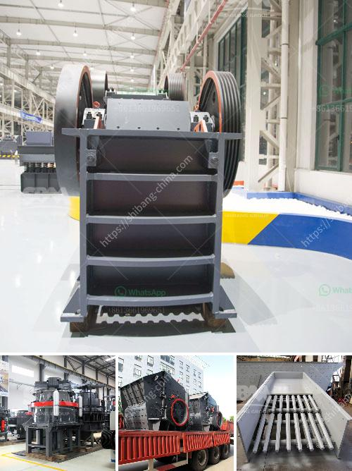

<h3>how to 100tph stone crushing plant</h3>
A stone crushing plant is a valuable investment opportunity for anyone looking to expand their industrial operations and increase revenue. With proper planning and execution, it can help generate substantial returns in a short period.

When setting up a stone crushing plant, the first thing to consider is the location of the quarry where the aggregates will be extracted. This is important because the processing plant needs to be close to the source of raw materials. This will help minimize transportation costs and ensure efficient production.

Next, it is crucial to assess the market demand for crushed stones in the area where the plant will operate. Conduct market research to understand the quantity and quality requirements of potential customers. Also, identify competitors and understand their pricing strategies to gain a competitive edge.

Once you have gathered all the necessary information, it's time to select the equipment needed for the stone crushing plant. This typically includes a jaw crusher for primary crushing, cone crushers for secondary crushing, vibrating screens for separating crushed materials, conveyors for efficient material transportation, and a control panel to monitor and control the production process.

When choosing the machinery, consider factors such as production capacity, energy efficiency, and maintenance requirements. Aim for a 100tph stone crushing plant to ensure a continuous supply of high-quality aggregates while meeting the market demand.

After setting up the plant, pay close attention to its operation and maintenance. Regularly inspect and lubricate the machinery to ensure optimal performance. Train the operators to follow proper safety protocols and conduct periodic safety audits to minimize accidents and injuries.

Additionally, carefully monitor the production process to detect any inefficiencies or bottlenecks quickly. Regularly review and analyze the plant's performance to identify areas for improvement and implement necessary modifications to increase productivity.

Lastly, focus on building strong relationships with suppliers and customers to secure a consistent supply of raw materials and expand your customer base. Advertise your stone crushing plant and promote your services to attract more clients. Provide excellent customer service to ensure customer satisfaction and encourage repeat business.

In conclusion, setting up and operating a 100tph stone crushing plant requires careful planning, market analysis, proper equipment selection, and regular maintenance. By following these steps, you can establish a profitable plant that will contribute to your business growth.
<h3>Contact us</h3><ul><li><strong>Whatsapp:&nbsp;<a href="https://wa.me/8613661969651">+8613661969651</a></strong></li><li><a href="https://swt.shibang-china.com/?git&amp;zhl&amp;how to 100tph stone crushing plant"><strong>Online Service(chat now)</strong></a></li></ul><h3>Related</h3><ul><li><a href='alluvial mining wash plant in canada.md'>alluvial mining wash plant in canada</a></li><li><a href='mini cement plant project report of cost setting in india.md'>mini cement plant project report of cost setting in india</a></li><li><a href='rock crusher production screen mesh.md'>rock crusher production screen mesh</a></li><li><a href='continuous ball mill capacity 500 hr.md'>continuous ball mill capacity 500 hr</a></li><li><a href='gypsum powder production.md'>gypsum powder production</a></li></ul>