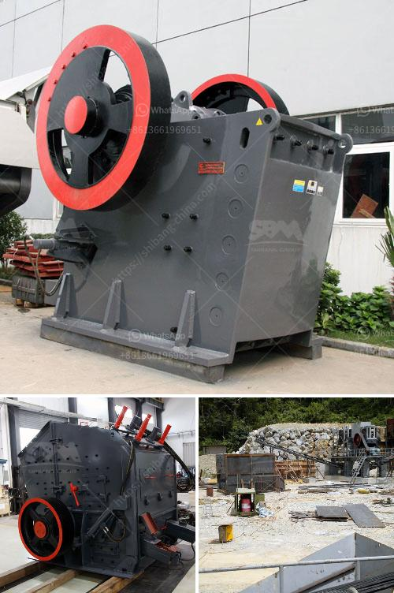

<h3>how to build a small rock crusher</h3>
Are you tired of the traditional gravel crushers taking up so much space in your yard? Or maybe you just want to try something new and creative? Building a small rock crusher is the perfect project for you.

Whether you are a novice or experienced rock crusher enthusiast, it is important to take the time to plan out the construction process. This article will provide you with step-by-step instructions on how to build a small rock crusher that can potentially transform the way you process rock materials.

Firstly, let's explore the materials required for this project. You will need a strong and sturdy base to support the weight of the crusher. A concrete base or wooden platform would be ideal for this purpose.

Next, you will need to gather the necessary components to build the crusher itself. The key components include a metal container (such as an old oil drum or metal pipe), a metal plate, a motor or engine, a pulley system, and a belt. You may also require a welder to secure the various components together.

Once you have gathered all the necessary materials, it is time to begin the construction process. Start by attaching the metal plate to one end of the metal container. This will serve as the crushing surface where rocks will be crushed.

Next, attach the motor or engine to the opposite end of the metal container. Make sure it is securely fastened and aligned properly. Then, connect the motor or engine to the metal plate using the pulley system and belt. This will allow the motor to power the crushing mechanism.

Once the crusher is assembled, it is time to test it. Load a few rocks into the metal container and turn on the motor or engine. As the motor begins to rotate, the metal plate will crush the rocks against it, resulting in smaller pieces.

To ensure the safety of the user, it is important to take a few precautions. Make sure to wear protective gear, such as gloves and safety glasses, during the construction and operation of the rock crusher. Additionally, keep children and pets away from the machine while it is in use.

In conclusion, building a small rock crusher can be a fun and rewarding project. It not only serves as a unique addition to your yard, but it also offers an alternative to traditional gravel crushers. By following the step-by-step instructions outlined in this article, you can create your own small rock crusher that has the potential to transform the way you process rock materials. So, grab your tools and get started on this exciting DIY project today!
<h3>Contact us</h3><ul><li><strong>Whatsapp:&nbsp;<a href="https://wa.me/8613661969651">+8613661969651</a></strong></li><li><a href="https://swt.shibang-china.com/?git&amp;zhl&amp;how to build a small rock crusher"><strong>Online Service(chat now)</strong></a></li></ul><h3>Related</h3><ul><li><a href='big slage crusher mechins plant.md'>big slage crusher mechins plant</a></li><li><a href='ball mill ball mill.md'>ball mill ball mill</a></li><li><a href='quartz processing machine.md'>quartz processing machine</a></li><li><a href='crusher seller in ethiopia.md'>crusher seller in ethiopia</a></li><li><a href='talc grinding plant.md'>talc grinding plant</a></li></ul>