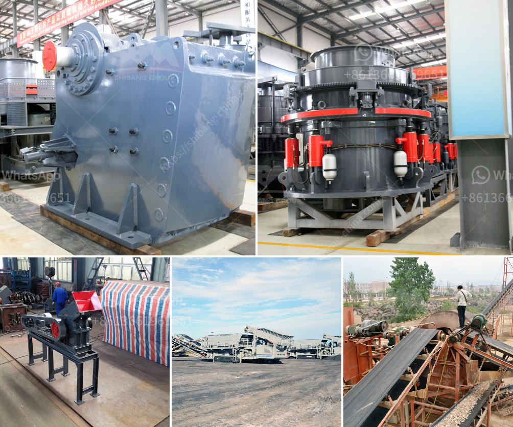

<h3>how to calculate tph of a cone crusher</h3>
Calculating TPH (tons per hour) of a cone crusher is a key process in many businesses that depend on crushing equipment to provide efficient and reliable outputs. The cone crusher is often used in aggregate and mineral processing industries for crushing medium-hard and above materials. This article explains how to calculate the TPH of a cone crusher.

Calculating TPH mainly consists of two factors – the maximum feed size and the desired product size. Typically, the maximum feed size is measured as the gape, which is the distance between the fixed and movable jaws at the top opening of the crushing chamber. The desired product size can be determined based on the customer's requirements or by considering the final application of the crushed material.

To calculate the TPH of a cone crusher, the maximum feed size of the material and the desired product size must be known. In general, the maximum feed size should not exceed 80% of the opening size of the crusher. Rule of thumb: the smaller the setting, the smaller the feed size, and vice versa. 

The reduction ratio refers to the ratio of the feed size to the product size. It is calculated by dividing the maximum feed size by the desired product size. By knowing the reduction ratio, the required cone crusher can be selected.

The actual capacity of a cone crusher is the volume of material that can be crushed per unit of time, which is TPH in this case. The volumetric flow rate (Q) can be calculated using the formula:

Where A is the cross-sectional area of the cone crusher outlet and V is the velocity of the material.

The TPH is calculated by dividing the product capacity (P) by the operating hours per day (H) and multiplying by 24 to convert to tons per day and then dividing by 1000 to convert to TPH.

It is important to note that the above calculations provide an estimate of the TPH and may vary depending on the actual operating conditions, such as material characteristics, crusher settings, and maintenance.

In conclusion, calculating the TPH of a cone crusher involves determining the maximum feed size and the desired product size and following a series of calculations to determine the actual capacity and TPH. These calculations are crucial for businesses that rely on efficient crushing operations to meet their production targets and provide high-quality products.
<h3>Contact us</h3><ul><li><strong>Whatsapp:&nbsp;<a href="https://wa.me/8613661969651">+8613661969651</a></strong></li><li><a href="https://swt.shibang-china.com/?git&amp;zhl&amp;how to calculate tph of a cone crusher"><strong>Online Service(chat now)</strong></a></li></ul><h3>Related</h3><ul><li><a href='aggregate crusher equipment.md'>aggregate crusher equipment</a></li><li><a href='mining mobile crusher and washing lebanon.md'>mining mobile crusher and washing lebanon</a></li><li><a href='talc powder grinding mills in lahore.md'>talc powder grinding mills in lahore</a></li><li><a href='sri lanka sand washing machine prices.md'>sri lanka sand washing machine prices</a></li><li><a href='hard rock pulverizer crusher.md'>hard rock pulverizer crusher</a></li></ul>