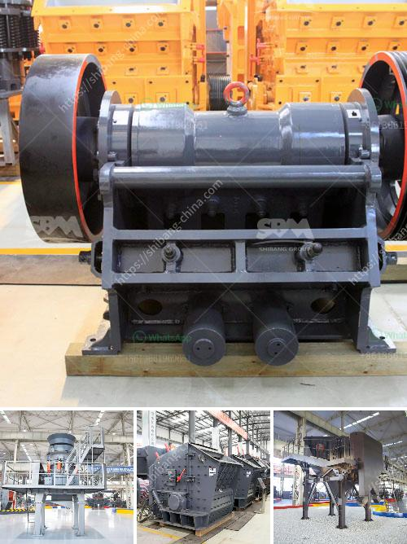

<h3>how to create a proposal for quarry factory</h3>
Building a successful quarry factory requires meticulous planning and a well-rounded proposal. This article will guide you through the process of creating a comprehensive proposal that addresses all key aspects and helps to secure financial support and necessary permits.

Begin by defining the objective of your quarry factory project. Are you focusing on producing specific construction materials or aggregates? Clearly articulating the purpose of the proposal sets the foundation for the subsequent sections.

Identify potential locations suitable for the quarry factory. Consider proximity to raw material sources, environmental impact, and transportation accessibility. Once a suitable site is pinpointed, highlight the property acquisition strategy, be it through lease or purchase agreements, emphasizing compliance with local regulations and conducting environmental assessments.

A quarry factory proposal must address environmental concerns. Outline comprehensive plans to mitigate the potential impact of material extraction and processing. Include strategies for dust and noise control, water management, and land restoration post-extraction. Consider engaging environmental experts to ensure adherence to environmental regulations and sustainable practices.

Develop a detailed operational plan showcasing the production process. Describe the machinery, equipment, and technology required, factors influencing output capacity, and projected production volumes. Emphasis should be placed on safety measures, protocols, and trained personnel necessary to operate the quarry efficiently.

Present a market analysis that demonstrates demand for the quarry's material output. Highlight existing construction projects, growth in the region, and potential customers. Develop a marketing strategy to attract potential clients, focusing on competitive pricing, quality assurance, and timely delivery. Include testimonials from potential buyers or industry experts whenever possible.

Conduct a financial feasibility study, outlining projected costs and revenue streams. Include estimates for land acquisition, quarry development, machinery, personnel, permits, and ongoing operational expenses. Detail potential funding sources such as bank loans, venture capitalist investments, or public partnerships. Provide a comprehensive financial forecast indicating profitability, liquidity, and payback period.

Creating a proposal for establishing a quarry factory demands thorough research, meticulous planning, and a comprehensive approach. With careful attention to environmental impact mitigation, operational details, and a well-crafted financial feasibility study, your proposal will impress investors, stakeholders, and permitting authorities, elevating your chances of securing the necessary permissions and financial support.
<h3>Contact us</h3><ul><li><strong>Whatsapp:&nbsp;<a href="https://wa.me/8613661969651">+8613661969651</a></strong></li><li><a href="https://swt.shibang-china.com/?git&amp;zhl&amp;how to create a proposal for quarry factory"><strong>Online Service(chat now)</strong></a></li></ul><h3>Related</h3><ul><li><a href='rock crusher machine in malaysia.md'>rock crusher machine in malaysia</a></li><li><a href='mobile crushing plant for sale in africa.md'>mobile crushing plant for sale in africa</a></li><li><a href='project on stone crushing unit.md'>project on stone crushing unit</a></li><li><a href='cone crusher design guideline pdf.md'>cone crusher design guideline pdf</a></li><li><a href='vertical raw mill industry.md'>vertical raw mill industry</a></li></ul>