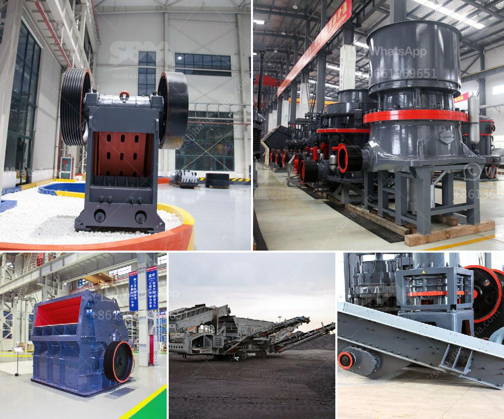

<h3>how to crusher granite</h3>
Granite, a type of igneous rock, is known for its durability and elegant appearance. It is commonly used for various construction projects, including countertops, flooring, and outdoor paving stones. However, before it can be transformed into the desired shape, granite needs to be crushed into smaller pieces. Crushing granite can be a challenging task, as it requires different techniques and equipment. In this article, we will guide you through the process of crushing granite effectively.

Before you start crushing granite, make sure you have a designated area for the task. Clear the area of any rocks, debris, or other materials that might interfere with the crushing process. You may consider using barriers or a containment system to ensure the crushed granite stays in a specific location.

Crushing granite can be a hazardous process, so safety should be a top priority. Make sure you are wearing appropriate personal protective equipment (PPE), such as safety glasses, gloves, and a dust mask. Ensure that all equipment and tools are in good working condition and follow the manufacturer's instructions.

To effectively crush granite, you will need suitable machinery. There are several types of equipment that can be used for this purpose, including jaw crushers, cone crushers, impact crushers, and even manual hammers and chisels. The choice of equipment will depend on the size and amount of granite you wish to crush, as well as your budget.

Once you have chosen the appropriate crushing equipment, it is time to set it up. Follow the manufacturer's instructions for assembly and installation. Make sure that all components are securely attached and aligned correctly. Double-check that the equipment is stable and does not pose any safety risks before starting the crushing process.

Carefully feed the granite stones or blocks into the crusher chamber. Ensure that the material is evenly distributed and not overcrowded. Overloading the crusher can lead to reduced efficiency and excessive wear on the equipment. Consider using a vibrating feeder or adjustable conveyor belt to regulate the flow of granite into the crusher.

Start the crusher at low power and gradually increase the pressure as the granite is being crushed. This gradual approach will ensure a more efficient and controlled crushing process. Monitor the output size of the crushed granite and adjust the settings of the crusher accordingly to achieve the desired final product.

After each crushing session, it is crucial to clean and maintain the equipment properly. Remove any accumulated debris, dust, or residual granite particles that may affect the performance of the crusher. Regularly inspect the equipment for signs of wear and tear, and replace any damaged parts promptly. Following proper maintenance procedures will prolong the lifespan of your equipment and ensure its optimal functionality.

In conclusion, crushing granite can be a complex process, but by following the steps outlined in this guide, you can crush granite effectively and efficiently. Remember to prioritize safety, choose the right equipment, and maintain it regularly to achieve the best results. With the proper techniques and equipment, you can transform large granite pieces into smaller, manageable sizes, ready for use in various construction projects.
<h3>Contact us</h3><ul><li><strong>Whatsapp:&nbsp;<a href="https://wa.me/8613661969651">+8613661969651</a></strong></li><li><a href="https://swt.shibang-china.com/?git&amp;zhl&amp;how to crusher granite"><strong>Online Service(chat now)</strong></a></li></ul><h3>Related</h3><ul><li><a href='harga mesin pemecah batu merek jepang.md'>harga mesin pemecah batu merek jepang</a></li><li><a href='rock crusher plant operations manager.md'>rock crusher plant operations manager</a></li><li><a href='coal mining machines in south africa.md'>coal mining machines in south africa</a></li><li><a href='sand washing plant cost in india.md'>sand washing plant cost in india</a></li><li><a href='metal crusher for sale in turkey.md'>metal crusher for sale in turkey</a></li></ul>