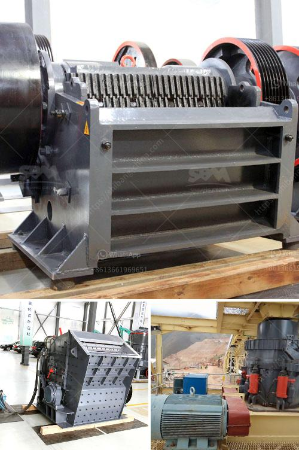

<h3>how to grind stone into fine powder</h3>
Grinding stones into a fine powder has been practiced for centuries. People have used various tools and techniques to accomplish this task, with the objective of obtaining powders of different sizes for multiple purposes. Whether you want to create pigments for artwork or use finely powdered minerals in recipes, here are some effective techniques to grind stone into a fine powder.

Firstly, gathering the right materials is crucial. You will need a sturdy mortar and pestle, which can be made from various materials such as metal, wood, or ceramic. Ensure that your mortar and pestle are clean and thoroughly dry before starting the process.

Start by placing your chosen stone in the mortar. It is advisable to break or cut the stone into smaller pieces, as this eases the grinding process. If you have a larger stone, use a hammer or chisel to break it into chunks. Remember to wear protective goggles and gloves to ensure your safety during this step.

Once you have the stone inside the mortar, firmly hold the pestle and apply downward pressure to crush the stone. Use a circular motion to grind the stone against the mortar's sides. This repetitive motion creates friction, causing the stone to crumble into smaller and finer particles.

During this process, it can be helpful to add small amounts of water to accelerate the grinding. This technique is particularly useful when grinding minerals such as talc or graphite, as moisture assists in producing finer powders. However, be cautious not to add too much water, as it may affect the desired consistency of the final powder.

Continue grinding your stone until you achieve the desired fineness. The longer you grind, the finer the powder will become. Always remember to take breaks during the process, as excessive grinding can strain your hands and wrists.

Once you're satisfied with the fineness of the powder, transfer it to a clean, dry container using a fine sieve or mesh. This will help eliminate any larger particles, resulting in a smoother, more even powder.

In conclusion, grinding stone into fine powder is a time-honored technique that requires patience and the right tools. By following these steps and using the appropriate materials, you can easily create finely powdered substances for various purposes, such as artistic endeavors or culinary applications. So, grab your mortar and pestle, select your favorite stone, and unlock the potential of grinding it into a fine powder.
<h3>Contact us</h3><ul><li><strong>Whatsapp:&nbsp;<a href="https://wa.me/8613661969651">+8613661969651</a></strong></li><li><a href="https://swt.shibang-china.com/?git&amp;zhl&amp;how to grind stone into fine powder"><strong>Online Service(chat now)</strong></a></li></ul><h3>Related</h3><ul><li><a href='coal crusher equipment.md'>coal crusher equipment</a></li><li><a href='stone crusher machine manufacturer in india.md'>stone crusher machine manufacturer in india</a></li><li><a href='vibrating screen manufacture in philippines.md'>vibrating screen manufacture in philippines</a></li><li><a href='slag vertical mill.md'>slag vertical mill</a></li><li><a href='gypsum board powder plant in ethiopia.md'>gypsum board powder plant in ethiopia</a></li></ul>