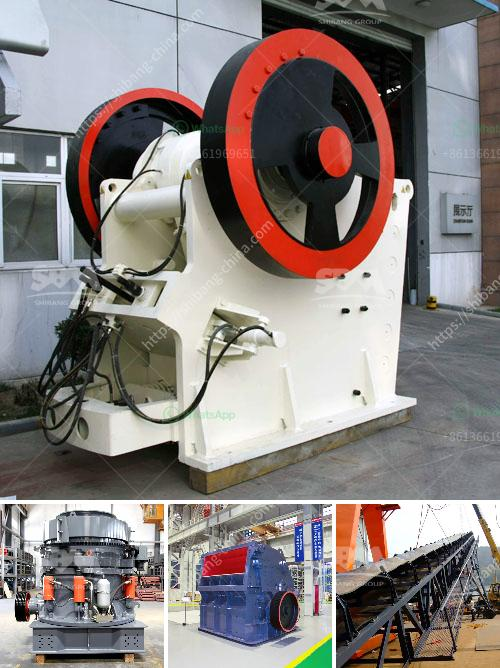

<h3>how to make a stone crusher</h3>
Stone crushing industry is an important industrial sector in the country, engaged in producing crushed stone of various sizes depending upon the requirement, which acts as raw material for various construction activities such as construction of roads, highways, bridges, buildings, and canals etc. It is estimated that there are over 12,000 stone crusher units in India.

The process involved in crushing large size stone boulders into different sizes of crushed stones is called as stone crushing. Crushing is done in three stages by jaw crushers, cone crushers and impact crushers. It is important to control the particle size of the crushed material to obtain satisfactory results of the construction project.

3. Use the angle grinder to cut a straight line across one side of the rock. This will be the base of your crusher.

4. Take the cut piece and place it on top of the remaining rock. Use the angle grinder or saw to cut a rectangular shape out of the other side of the rock.

5. Once the shape is cut, use the power drill with a masonry drill bit to make holes along the edges of the rectangular shape. These holes will be used to insert the bolts for attaching the metal plates.

6. Now, use the welder to attach two metal plates on top of the base and on the sides of the rectangular shape, leaving one side open for the entrance of the stones.

9. Once everything is in place, start feeding the stones into the stone crusher through the entrance. Use the handle to apply pressure and crush the stones into desired sizes.

Remember to take necessary safety precautions while making and operating the stone crusher. Proper maintenance and regular servicing of the machine will ensure its long life and efficient functioning.
<h3>Contact us</h3><ul><li><strong>Whatsapp:&nbsp;<a href="https://wa.me/8613661969651">+8613661969651</a></strong></li><li><a href="https://swt.shibang-china.com/?git&amp;zhl&amp;how to make a stone crusher"><strong>Online Service(chat now)</strong></a></li></ul><h3>Related</h3><ul><li><a href='graphite mine slurry ball mill.md'>graphite mine slurry ball mill</a></li><li><a href='crushing plants south africa.md'>crushing plants south africa</a></li><li><a href='materials for conveyor belts in nigeria.md'>materials for conveyor belts in nigeria</a></li><li><a href='limestone powder making machine india.md'>limestone powder making machine india</a></li><li><a href='cost of conveyor belt system for coal loading.md'>cost of conveyor belt system for coal loading</a></li></ul>