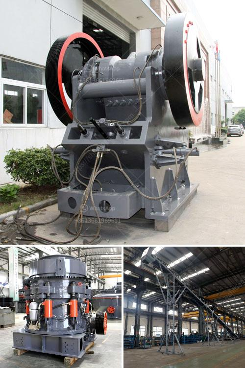

<h3>how to make a vibrating shaft for vibrating screens</h3>
Vibrating screens are extensively used in various industries to separate materials based on size. The key component responsible for generating the necessary vibration is the vibrating shaft. In this article, we will discuss the process of creating a robust and efficient vibrating shaft for vibrating screens.

Before starting the fabrication process, it is crucial to design the vibrating shaft properly. Consider factors such as the screen's size, weight, and the desired frequency and amplitude of vibration. Choose materials known for their durability and resistance to wear, such as high-quality steel or stainless steel.

To achieve a balanced and smooth operation, precision machining is essential during the fabrication of the vibrating shaft. Utilize advanced machining techniques, such as CNC (Computer Numerical Control), to ensure accurate dimensions and minimize any imbalances or misalignments.

Assemble the vibrating shaft by fitting necessary components such as eccentric weights, bearings, and couplings. Eccentric weights play a crucial role in creating the desired vibration. Ensure that the weights are properly balanced and positioned symmetrically on the shaft to minimize any unwanted vibrations.

Apply appropriate lubrication to the bearings and other movable parts of the vibrating shaft. Regular maintenance, including inspecting for wear and tear, must be performed to ensure smooth operation and avoid unexpected breakdowns.

Once the vibrating shaft is ready, it is crucial to test and calibrate it before integrating it into the vibrating screen. This step ensures that the shaft generates the desired frequency and amplitude of vibration required for efficient material separation. Adjustments can be made during the testing phase to improve alignment and balance for optimal functioning.

Constructing a reliable vibrating shaft for vibrating screens involves meticulous design, precision machining, proper assembly, lubrication, and calibration. By following these steps and choosing high-quality materials, one can create a robust vibrating shaft that guarantees the smooth and efficient operation of vibrating screens. Remember to conduct regular maintenance and inspection to prolong the life of the shaft and ensure consistent performance.
<h3>Contact us</h3><ul><li><strong>Whatsapp:&nbsp;<a href="https://wa.me/8613661969651">+8613661969651</a></strong></li><li><a href="https://swt.shibang-china.com/?git&amp;zhl&amp;how to make a vibrating shaft for vibrating screens"><strong>Online Service(chat now)</strong></a></li></ul><h3>Related</h3><ul><li><a href='dolomite grinding upmesh plant ih india.md'>dolomite grinding upmesh plant ih india</a></li><li><a href='used stone crusher in ontario.md'>used stone crusher in ontario</a></li><li><a href='removing iron from silica sand.md'>removing iron from silica sand</a></li><li><a href='production process clinker zurich switzerland.md'>production process clinker zurich switzerland</a></li><li><a href='powder mill rollers machine.md'>powder mill rollers machine</a></li></ul>