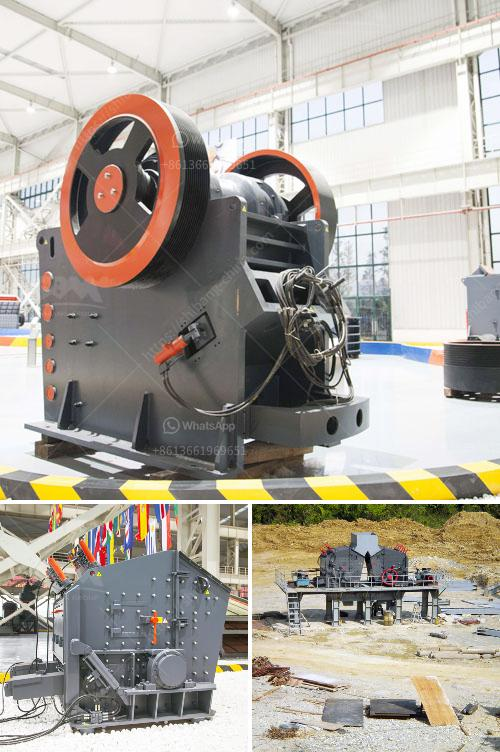

<h3>how to make barite powder</h3>
Barite powder is a naturally occurring mineral that has a wide range of applications in various industries. It is commonly used as a weighting agent in drilling fluids, as a filler in different products, and as a pigment in paints and coatings. If you are interested in making your own barite powder, here is a simple guide to get you started.

Firstly, you need to have access to high-quality barite ore. You can usually find this mineral in regions that are known for their mineral deposits. Barite ore is typically obtained through mining operations.

Once you have obtained the barite ore, the next step is to crush it into smaller pieces. You can use a crusher or a pulverizer to achieve the desired particle size. It is important to ensure that the barite ore is evenly crushed to obtain a consistent powder.

After crushing, the barite ore needs to go through a milling process. This step involves grinding the ore into finer particles using a specialized mill. The milling process helps to further refine the particle size and ensure the powder is of the desired consistency.

Once the barite ore has been milled, you need to separate the powder from any impurities or unwanted materials. This can be done through a process called flotation. Flotation involves adding chemicals that bind to the barite particles and make them float, while the impurities sink. The floated barite powder can then be collected and dried.

Finally, the dried barite powder needs to be properly packaged and stored. It is important to keep the powder in a moisture-free environment to prevent its properties from deteriorating. Barite powder can be stored in sealed containers or bags to maintain its quality.

In conclusion, making barite powder involves obtaining high-quality barite ore, crushing it into smaller pieces, milling to achieve the desired particle size, flotation to remove impurities, and proper packaging and storage. By following these steps, you can produce your own barite powder for various applications in different industries.
<h3>Contact us</h3><ul><li><strong>Whatsapp:&nbsp;<a href="https://wa.me/8613661969651">+8613661969651</a></strong></li><li><a href="https://swt.shibang-china.com/?git&amp;zhl&amp;how to make barite powder"><strong>Online Service(chat now)</strong></a></li></ul><h3>Related</h3><ul><li><a href='feldspar mining process.md'>feldspar mining process</a></li><li><a href='gypsum making machine.md'>gypsum making machine</a></li><li><a href='manufacturing talcum powder in india.md'>manufacturing talcum powder in india</a></li><li><a href='ballast crushing machinery.md'>ballast crushing machinery</a></li><li><a href='stone crusher in inda or parkistan.md'>stone crusher in inda or parkistan</a></li></ul>