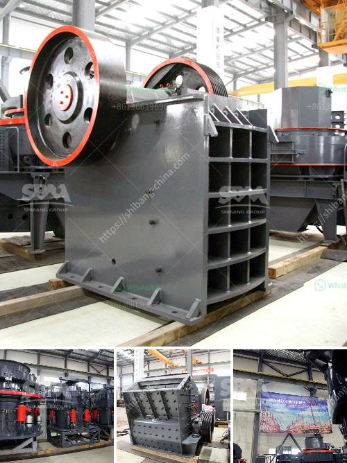

<h3>how to make marble powder statues</h3>
Marble powder statues are a beautiful and timeless form of art that can bring elegance and sophistication to any space. Creating these statues requires careful precision and skill, but with the right tools and techniques, it is a highly rewarding and fulfilling process. In this article, we will guide you through the steps of making marble powder statues.

First and foremost, you will need marble powder. You can either purchase it from art supply stores or create your own by crushing marble chips or pieces. Make sure to choose a high-quality marble powder to ensure the best results.

Once you have your marble powder, the next step is to create the statue's mold. You can either sculpt the mold using clay or use a ready-made mold, depending on your preference and expertise. Keep in mind that your mold should be properly proportioned and sized to achieve the desired outcome. It should also be durable to withstand the pressure of pouring the marble powder.

After the mold is ready, it's time to prepare the marble powder mixture. Mix the marble powder with a binding agent such as resin or epoxy. This will help the powder to adhere and solidify properly. The ratio of marble powder to binding agent may vary depending on the specific requirements of your project, so it's important to follow the instructions provided by the manufacturer.

Once the marble powder mixture is ready, carefully pour it into the prepared mold. Be meticulous in ensuring that every detail of the mold is filled, as any gaps or inconsistencies may affect the final outcome. Use a spatula or a tool with a flat edge to smoothen the surface of the mixture and remove any excess.

Now, leave the mold to dry and cure. The curing time can vary depending on the type of binding agent used, so refer to the manufacturer's instructions for an accurate timeframe. During this stage, it's vital to protect the mold from external disturbances and ensure proper ventilation.

After the curing process is complete, carefully remove the statue from the mold. Take your time and be gentle to avoid any damages or breakages. Once the statue is out, you can further refine its appearance by sanding the surface with fine-grit sandpaper. This will smooth out any rough edges and imperfections, giving the statue a polished and professional finish.

Finally, you can choose to leave the statue in its natural white marble color or apply a protective coating or paint to enhance its aesthetics and longevity. Make sure to use appropriate products and follow the instructions for the best results.

Creating marble powder statues requires patience, precision, and a keen eye for detail. It is an art form that demands practice and expertise. But with the right materials, technique, and dedication, you can create breathtaking marble powder statues that will stand the test of time and add a touch of classic beauty to any environment. So, roll up your sleeves, gather your tools, and let your creativity flow as you embark on this exciting artistic journey.
<h3>Contact us</h3><ul><li><strong>Whatsapp:&nbsp;<a href="https://wa.me/8613661969651">+8613661969651</a></strong></li><li><a href="https://swt.shibang-china.com/?git&amp;zhl&amp;how to make marble powder statues"><strong>Online Service(chat now)</strong></a></li></ul><h3>Related</h3><ul><li><a href='equipment perlite mining.md'>equipment perlite mining</a></li><li><a href='barite grinding equipment.md'>barite grinding equipment</a></li><li><a href='hard rock pulverizer crusher.md'>hard rock pulverizer crusher</a></li><li><a href='sell old stone crusher.md'>sell old stone crusher</a></li><li><a href='how much in bauxite crushing plant.md'>how much in bauxite crushing plant</a></li></ul>