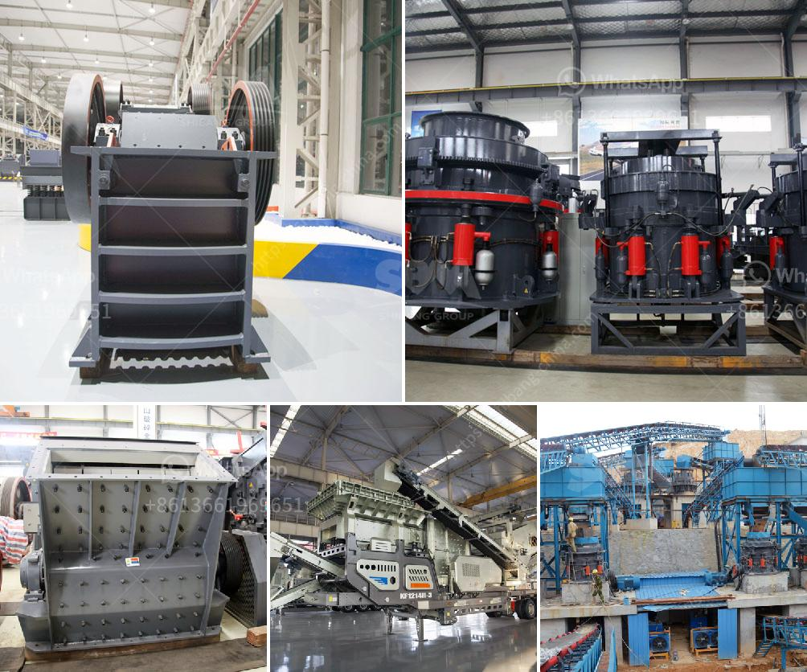

<h3>how to remove gold dust from sand</h3>
Gold mining has been practiced for thousands of years, with evidence dating back as far as 2600 BC in ancient Sumeria. The precious metal has always captivated individuals, with its unique luster and enduring value. One of the most common methods to extract gold from sand is by panning, a traditional gold mining technique. However, the process can be time-consuming and may not always yield significant results. This article will provide alternative methods to separate gold dust from sand, allowing for a more efficient and productive gold recovery process.

One effective method to remove gold dust from sand is by using magnets to attract the sand particles. The magnets will draw the gold away from the sand, along with other impurities, leaving only pure gold. Magnetic separation is a popular and effective method that has been used for centuries.

Flotation is another method commonly used to separate gold from sand. This process involves mixing the powdered gold-bearing sand with water and several chemicals. The mixture is then agitated to form bubbles, which will attach to the gold particles. These gold-laden bubbles are then separated and collected, leaving behind the sand.

Gravity separation is another widely used method to separate gold dust from sand. This process relies on the differences in density between gold and sand particles. By using water and a system of inclined plates, gold particles will sink to the bottom, while the lighter sand particles will float. The separated gold can then be collected from the bottom of the system.

Electrolysis is a more advanced method to remove gold dust from sand. This process involves using an electric current to separate gold from other impurities. In a simple setup, a gold-bearing sand mixture is submerged in a container filled with an electrolyte solution. By passing a current through the solution, the gold particles will transfer to the anode, leaving behind the sand.

Chemical leaching involves the use of chemical agents to dissolve the gold particles from the sand. This method requires caution and should only be performed by experienced individuals. One commonly used chemical is cyanide, which has been utilized in gold mining for many years. The sand and gold mixture is treated with the cyanide solution, which dissolves the gold particles. The dissolved gold can then be separated and collected for further processing.

In conclusion, the removal of gold dust from sand can be achieved through various methods, depending on the desired efficiency and the resources available. While traditional methods like panning are viable options, alternative techniques such as magnetic separation, flotation, gravity separation, electrolysis, and chemical leaching provide more efficient and productive ways to extract gold from sand. It is important to consider the environmental impact and safety precautions associated with these processes. Additionally, it is recommended to seek guidance and advice from experienced individuals or professionals before attempting any gold extraction methods.
<h3>Contact us</h3><ul><li><strong>Whatsapp:&nbsp;<a href="https://wa.me/8613661969651">+8613661969651</a></strong></li><li><a href="https://swt.shibang-china.com/?git&amp;zhl&amp;how to remove gold dust from sand"><strong>Online Service(chat now)</strong></a></li></ul><h3>Related</h3><ul><li><a href='dry processing of coal in south africa.md'>dry processing of coal in south africa</a></li><li><a href='fine powder milling machines.md'>fine powder milling machines</a></li><li><a href='sell old stone crusher.md'>sell old stone crusher</a></li><li><a href='mobile gold processing plant 1 2 tph.md'>mobile gold processing plant 1 2 tph</a></li><li><a href='gravel stone crusher plant.md'>gravel stone crusher plant</a></li></ul>