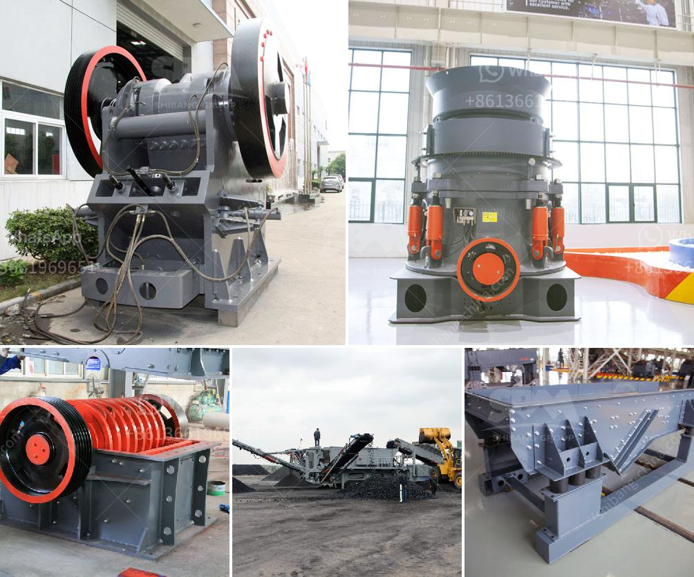

<h3>how to shim a jaw crusher</h3>
A jaw crusher is a mechanical device that uses compressive force for breaking of solid materials. This force is achieved by the two jaws of the crusher, one of which remains stationary while the other moves back and forth. The squeezing motion of the jaws ensures efficient crushing of the raw materials. However, in some cases, the gap between the jaws needs to be adjusted to achieve the desired size of the crushed material. This adjustment is usually done by shimming the toggle block.

Shimming a jaw crusher involves inserting a shim behind the toggle block, which moves the jaws closer or farther apart. The desired size of the crushed material can be achieved by changing the thickness of the shim. By properly adjusting the shim, the size of the particles produced can be controlled, ensuring that the final product meets the specifications.

1. Safety first: Before performing any maintenance on the crusher, make sure it is turned off and the power source is disconnected. This will prevent accidental start-up and potential injury.

2. Access the toggle block: The toggle block is located at the lower end of the swing jaw. Remove any obstructions and ensure clear access to it.

3. Determine the size of the shim: Measure the current gap between the jaws using a feeler gauge or similar tool. Calculate the required thickness of the shim based on the desired adjustment.

4. Insert the shim: Slide the shim behind the toggle block, ensuring it is properly aligned with the mating surfaces. The shim should be thick enough to achieve the desired reduction in the gap but not too thick that it causes excessive pressure on the toggle block.

5. Test and adjust: Once the shim is inserted, turn on the crusher and check the gap between the jaws. Repeat the insertion and testing process as necessary until the desired size of the crushed material is achieved.

It is important to note that shimming a jaw crusher should be done in consultation with the manufacturer's guidelines and recommendations. Any modifications or adjustments to the crusher should be carried out by trained personnel to ensure safety and optimal performance.

In conclusion, shimming a jaw crusher allows for precise adjustment of the gap between the jaws, enabling control over the size of the crushed material. Following the proper steps and guidelines will help achieve the desired results while prioritizing safety and equipment integrity.
<h3>Contact us</h3><ul><li><strong>Whatsapp:&nbsp;<a href="https://wa.me/8613661969651">+8613661969651</a></strong></li><li><a href="https://swt.shibang-china.com/?git&amp;zhl&amp;how to shim a jaw crusher"><strong>Online Service(chat now)</strong></a></li></ul><h3>Related</h3><ul><li><a href='roks vertical mill.md'>roks vertical mill</a></li><li><a href='small rock crushers.md'>small rock crushers</a></li><li><a href='mini stone crusher machine in finland.md'>mini stone crusher machine in finland</a></li><li><a href='specification of a ball mill.md'>specification of a ball mill</a></li><li><a href='grinding machine manufacturers and suppliers in india.md'>grinding machine manufacturers and suppliers in india</a></li></ul>