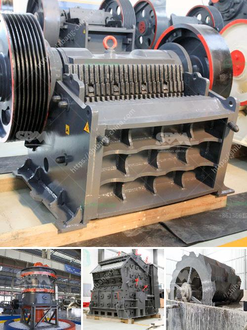

<h3>how to start a stone crushing company in canada</h3>
Starting a stone crushing company is a major undertaking that requires substantial capital investment. However, if you are confident in your ability to successfully launch and operate a profitable business, you can make it happen. To get started on your entrepreneurial journey, here are some essential steps for establishing a stone crushing company in Canada.

1. Research the Market: Begin by researching the aggregate industry in Canada, including the supply and demand for crushed stones. Identify potential customers such as construction companies, road builders, and landscaping companies to understand the market opportunities and challenges.

2. Create a Business Plan: A well-written business plan is crucial for securing funding and guiding your company’s growth. It should outline your company’s objectives, target market, competitive analysis, marketing strategy, financial projections, and operational plans. Make sure to include details about the required capital investment, equipment, and anticipated profits.

3. Obtain Financing: Starting a stone crushing company requires significant capital investment, which can be obtained through various sources. Options could include securing a bank loan, seeking investments from private individuals or venture capitalists, or even utilizing personal savings. Approach multiple funding channels to maximize your chances of success.

4. Acquire Equipment: To operate a stone crushing company efficiently, you need specialized equipment such as a crusher, a conveyor system, and screeners. Depending on the scale of your operations, you may also need loaders, trucks, and excavators. Ensure that your equipment meets industry standards and environmental regulations.

5. Obtain the Necessary Permits and Licenses: Operating a stone crushing company requires compliance with various federal, provincial, and local regulations. Obtain the necessary permits and licenses related to environmental impact assessments, wastewater discharge permits, and land use considerations. Contact the appropriate governmental authorities to understand the requirements specific to your area.

6. Establish a Site: Locate a suitable site for your stone crushing company. Ensure that the location has ample space for equipment, stockpiling crushed stones, and necessary infrastructure. Consider access to major roads and proximity to potential customers to minimize transportation costs.

7. Start Advertising and Promoting: Develop a comprehensive marketing strategy to attract potential customers and secure contracts. Utilize online platforms to create a professional website and social media presence. Attend industry trade shows and conferences to network with potential customers and suppliers. Consider advertising on relevant industry publications and directories to increase visibility.

8. Hire Qualified Staff: As your business expands, recruit employees who possess the necessary skills and experience in the stone crushing industry. Consider hiring experienced operators, mechanics, and administrative staff. Train your workforce on safety protocols, equipment operation, and customer service to ensure smooth and efficient operations.

9. Comply with Health and Safety Guidelines: Prioritize the health and safety of your employees and ensure compliance with industry regulations. Implement a health and safety plan, conduct regular inspections, and provide proper safety equipment and training to prevent accidents and injuries.

10. Focus on Growth and Innovation: To sustain long-term success, continuously monitor market trends, explore new products and services, and invest in research and development. Seek feedback from customers and adapt to their changing needs. Embrace technological advancements to streamline operations and improve efficiency.

Starting a stone crushing company is a challenging yet rewarding endeavor. By following these steps diligently and remaining committed to excellence, you can establish a successful stone crushing company in Canada. Remember to constantly review and adjust your business strategies to ensure continued growth and profitability.
<h3>Contact us</h3><ul><li><strong>Whatsapp:&nbsp;<a href="https://wa.me/8613661969651">+8613661969651</a></strong></li><li><a href="https://swt.shibang-china.com/?git&amp;zhl&amp;how to start a stone crushing company in canada"><strong>Online Service(chat now)</strong></a></li></ul><h3>Related</h3><ul><li><a href='jaw crusher global machines sweden ab.md'>jaw crusher global machines sweden ab</a></li><li><a href='hammer mill machine 20hp.md'>hammer mill machine 20hp</a></li><li><a href='high efficiency 200tph jaw crusher with great price.md'>high efficiency 200tph jaw crusher with great price</a></li><li><a href='granite crusher machine.md'>granite crusher machine</a></li><li><a href='catalog of stone crusher production line made in iran.md'>catalog of stone crusher production line made in iran</a></li></ul>