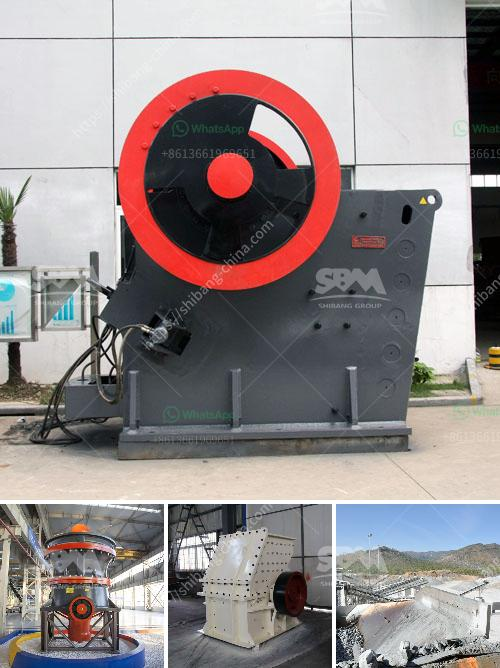

<h3>how to start sand business in nigeria</h3>
Nigeria, with its expanding population and rapid urbanization, has a high demand for sand, making it a profitable sector for entrepreneurs. Starting a sand business in Nigeria can be a lucrative venture if approached strategically and with careful planning. This article will provide a step-by-step guide on how to start a sand business in Nigeria.

Conduct thorough research on the sand business in your target area. Evaluate the demand for sand, local competition, pricing, and potential customers. A feasibility study will help you assess the viability of your sand business and develop a sound business plan.

To operate legally in Nigeria, register your sand business with the Corporate Affairs Commission (CAC). Choose a suitable business structure, such as a sole proprietorship or limited liability company, and obtain the necessary permits and licenses from local authorities.

Identify an ideal location for your sand business close to construction sites and major roadways. Secure a sufficient amount of land to store and process the sand. Acquire the required equipment for sand extraction, including excavators, loaders, trucks, and a sand washing machine for refining the quality of the sand.

Establish strong relationships with sand suppliers and negotiate favorable terms for bulk purchases. Seek collaboration with construction companies, building contractors, and government agencies involved in infrastructure development. Engage in networking events and trade fairs to promote your sand business and connect with key stakeholders.

Implement strict quality control measures to ensure your sand meets the required standards. Provide a reliable and consistent supply of sand with minimal impurities. This will help build trust and attract loyal customers, establishing your sand business as a reputable source for quality construction materials.

Determine competitive pricing for your sand considering factors such as production costs, transportation expenses, and market demand. Establish a profit margin that balances affordability for customers while ensuring a sustainable profit for your business. Regularly review your pricing strategy to remain competitive and adjust accordingly.

Develop a comprehensive marketing strategy to increase awareness of your sand business. Utilize online platforms, such as social media, websites, and online directories, to promote your services and engage with potential customers. Traditional marketing methods, such as flyers, billboards, and radio advertisements, can also be effective for reaching a broader audience.

Hire competent and reliable staff to assist with daily operations, including extraction, processing, and delivery of sand. Provide proper training to ensure high productivity and minimize accidents or damages. Implement efficient logistics and inventory management systems to streamline your operations and meet customer demands effectively.

Maintain excellent customer service to foster long-term relationships. Provide prompt delivery, accurate billing, and friendly support to ensure customer satisfaction. Address any concerns or complaints promptly and strive to exceed customer expectations.

Regularly assess your operations, customer feedback, and market trends to identify opportunities for improvement. Explore diversification into related sectors, such as building materials supply or construction consultancy, to expand your sand business and increase profitability.

Starting a sand business in Nigeria requires dedication, thorough planning, and a commitment to providing quality products and services. By following these steps and adapting to the changing market dynamics, you can establish a successful sand business that contributes to Nigeria's growing construction industry.
<h3>Contact us</h3><ul><li><strong>Whatsapp:&nbsp;<a href="https://wa.me/8613661969651">+8613661969651</a></strong></li><li><a href="https://swt.shibang-china.com/?git&amp;zhl&amp;how to start sand business in nigeria"><strong>Online Service(chat now)</strong></a></li></ul><h3>Related</h3><ul><li><a href='second hand mobile crusher plant.md'>second hand mobile crusher plant</a></li><li><a href='how to make a stone crusher.md'>how to make a stone crusher</a></li><li><a href='layout design for stone crushing plant.md'>layout design for stone crushing plant</a></li><li><a href='vertical milling machine used for calcium carbonate.md'>vertical milling machine used for calcium carbonate</a></li><li><a href='used stone crusher machine in italia.md'>used stone crusher machine in italia</a></li></ul>