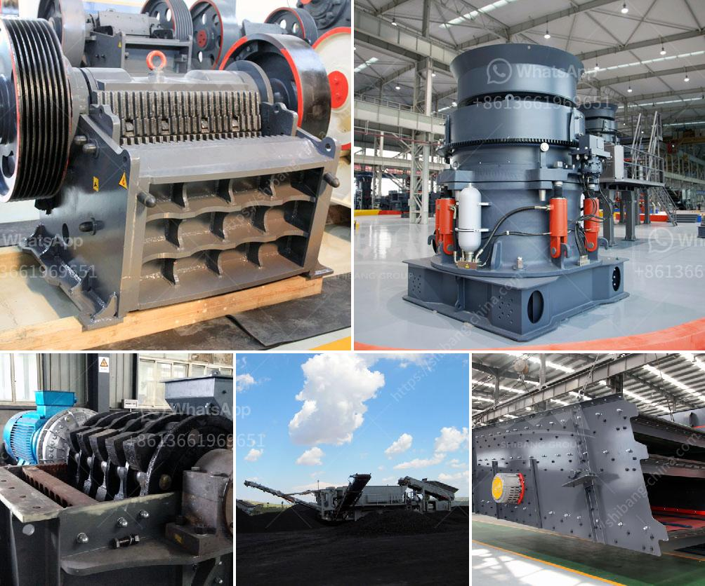

<h3>hp cone crusher</h3>
The HP cone crusher is commonly used as a secondary or tertiary crusher in aggregation or mining operations. It is robust and versatile, and delivers high crushing ratios and excellent particle shape. Thanks to its hydraulic adjustment system, it can ensure consistent performance even in the most challenging conditions.

One of the key advantages of the HP cone crusher is its ability to increase the reduction ratio, resulting in better end-product shape and high-quality aggregate. The high-capacity design allows the crusher to handle larger tonnages, enabling it to process more material at a faster rate.

The HP cone crusher is known for its reliability, versatility, and high-efficiency. It can effectively process a wide range of materials, including granite, limestone, iron ore, and others. In addition, the crusher is available with a variety of optional features, such as remote control, hydraulic clearing, and tramp release, providing flexibility and convenience in operation.

The hydraulic adjustment system of the HP cone crusher allows for easy and precise setting adjustments to achieve the desired product size. It also ensures consistent performance and minimizes downtime, as the crusher automatically adapts to changes in feed conditions. With the push-button control panel, operators can easily adjust the crusher settings, optimizing the production process and maximizing throughput.

Another notable feature of the HP cone crusher is its user-friendly design. The crusher is equipped with a large feed opening, which makes it easy to feed material into the crushing chamber. It also provides excellent access for maintenance and servicing, ensuring a quick and hassle-free process.

The HP cone crusher is built to withstand harsh working conditions and heavy-duty applications. Its rugged construction and durable components make it suitable for continuous operation in demanding environments. The crusher's high-quality steel mainframe and robust eccentric assembly ensure a long and reliable service life.

Overall, the HP cone crusher provides impressive performance and efficiency, making it an excellent choice for aggregate producers and mining operations. It offers a range of benefits, including high crushing ratios, excellent particle shape, and improved end-product quality. With its robust design and user-friendly features, the HP cone crusher is an essential equipment for any crushing operation.
<h3>Contact us</h3><ul><li><strong>Whatsapp:&nbsp;<a href="https://wa.me/8613661969651">+8613661969651</a></strong></li><li><a href="https://swt.shibang-china.com/?git&amp;zhl&amp;hp cone crusher"><strong>Online Service(chat now)</strong></a></li></ul><h3>Related</h3><ul><li><a href='copper factory layout design.md'>copper factory layout design</a></li><li><a href='hard rock quarry crusher in libya.md'>hard rock quarry crusher in libya</a></li><li><a href='cone crusher manufacturers for sale in italy.md'>cone crusher manufacturers for sale in italy</a></li><li><a href='marble mining equipment.md'>marble mining equipment</a></li><li><a href='silica quartz grinding mill 400 mash.md'>silica quartz grinding mill 400 mash</a></li></ul>