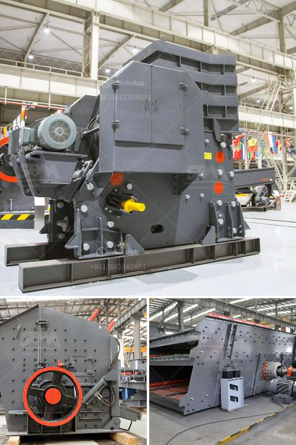

<h3>hydraulic cone crusher</h3>
Hydraulic cone crusher, also known as hydraulic crusher, is a type of cone crusher that is extensively used in industries like mining, metallurgy, construction material, chemical, and water power. Hydraulic cone crusher adopts the principle of intergranular lamination, which reduces the needle-like materials to a greater extent.

One of the significant advantages of hydraulic cone crusher is its high crushing ratio, which helps in producing uniform particle size to meet various crushing requirements. This crusher also ensures high productivity and efficiency due to its hydraulic protection system, which automatically removes the foreign material to prevent damage to the machine.

The hydraulic cone crusher consists of a crushing chamber, hydraulic adjustment and overload protection, a system, hydraulic lubrication, and a hydraulic control system. The crusher's hydraulic adjustment system allows for the adjustment of the crusher's discharge port size to control the particle size of the final product. This feature is particularly useful in crushing operations that require different sizes of aggregate or stone materials.

Another key feature of the hydraulic cone crusher is its hydraulic overload protection system. This system ensures that the crusher remains protected from overloading or damage caused by foreign materials or uncrushable objects, such as iron or wood, accidentally entering the chamber. The hydraulic control system effectively prevents damage to the machine, increasing its lifespan and reducing downtime.

In addition to these features, the hydraulic cone crusher offers a simple maintenance process and low operating costs. Its hydraulic lubrication system reduces maintenance and ensures smooth operation. The crusher's high-quality components, such as hydraulic system, electronic control system, and wear-resistant parts, contribute to its long-lasting performance.

With its remarkable features and advantages, the hydraulic cone crusher has become an essential equipment in various industries. Its ability to crush hard and large materials effectively and efficiently makes it suitable for primary, secondary, and tertiary crushing applications. Moreover, the hydraulic cone crusher significantly improves the overall production capacity and quality of finished products.

In conclusion, the hydraulic cone crusher is a reliable and efficient crusher machine that delivers consistent performance. Its robust construction, advanced technology, and high crushing ratio make it a valuable asset in any crushing operation. Whether it is used for mining, construction, or other industries, the hydraulic cone crusher is an excellent choice that ensures productivity, durability, and cost-effectiveness.
<h3>Contact us</h3><ul><li><strong>Whatsapp:&nbsp;<a href="https://wa.me/8613661969651">+8613661969651</a></strong></li><li><a href="https://swt.shibang-china.com/?git&amp;zhl&amp;hydraulic cone crusher"><strong>Online Service(chat now)</strong></a></li></ul><h3>Related</h3><ul><li><a href='river sand suppliers in northern cape.md'>river sand suppliers in northern cape</a></li><li><a href='aggregate quarry crusher philippines.md'>aggregate quarry crusher philippines</a></li><li><a href='buy impact crushers.md'>buy impact crushers</a></li><li><a href='hydraulic cone crusher.md'>hydraulic cone crusher</a></li><li><a href='rock crusher machine.md'>rock crusher machine</a></li></ul>