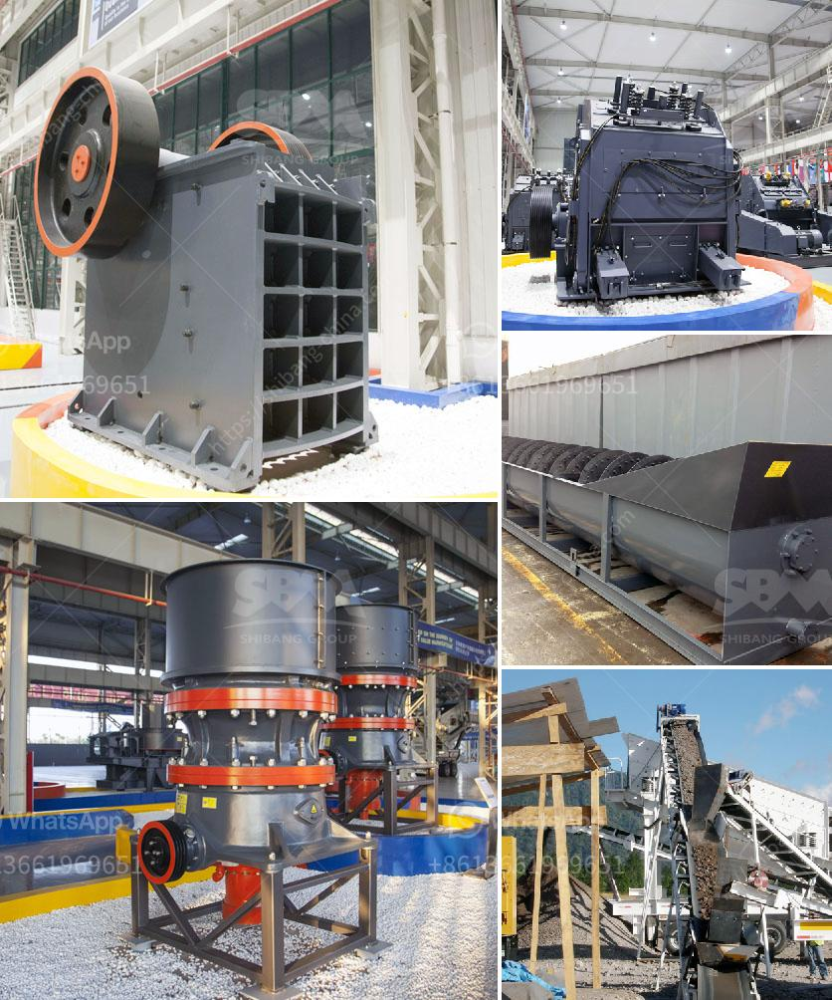

<h3>impact crusher 500tph spcfication</h3>
The impact crusher is a highly efficient and versatile crushing machine that is capable of crushing a wide variety of materials. This machine serves as a primary and secondary crusher in the mining, construction, and recycling industries. The impact crusher has a number of advantages over other crushers such as jaw crushers and cone crushers, including lower operating costs, higher production efficiency, and more reliable performance.

One of the key features of the impact crusher is its ability to handle a large feed size, making it ideal for primary and secondary crushing applications. With a maximum feed size of up to 800mm, this crusher is capable of crushing materials such as limestone, granite, and concrete into particles as small as 10mm or less. This allows for the production of high-quality aggregates, which are often used in the construction industry.

The impact crusher is also equipped with a high-capacity and high-efficiency screening system that can sieve materials to different specifications. This allows operators to produce different sizes of aggregates to meet specific requirements. The screening system is designed to ensure that only the desired size of material passes through the crusher, minimizing waste and maximizing productivity.

In addition to its impressive capacity and efficiency, the impact crusher is also known for its low operating costs. The machine is designed to consume less energy than other crushers, resulting in lower fuel consumption and reduced carbon emissions. This not only benefits the environment but also helps operators save money on fuel costs. Furthermore, the impact crusher is equipped with wear-resistant components, such as blow bars and impact plates, which significantly reduce maintenance and replacement costs.

Another notable feature of the impact crusher is its versatility in terms of application. It can be used to crush a wide range of materials, from soft and medium-hard rocks to abrasive and hard materials. This makes the impact crusher suitable for various industries, including mining, quarrying, and recycling. Whether it is crushing concrete debris, recycling asphalt, or processing hard rock, the impact crusher is a reliable and efficient crushing solution.

To conclude, the impact crusher is a reliable and versatile crushing machine that offers a number of advantages over other crushers. With its ability to handle large feed sizes, high-capacity screening system, and low operating costs, this crusher is ideal for a wide range of applications. Whether it is used in mining, construction, or recycling, the impact crusher delivers high-quality aggregates efficiently and reliably. If you are in need of a crushing solution that maximizes productivity and minimizes costs, the impact crusher is indeed a worthy investment.
<h3>Contact us</h3><ul><li><strong>Whatsapp:&nbsp;<a href="https://wa.me/8613661969651">+8613661969651</a></strong></li><li><a href="https://swt.shibang-china.com/?git&amp;zhl&amp;impact crusher 500tph spcfication"><strong>Online Service(chat now)</strong></a></li></ul><h3>Related</h3><ul><li><a href='vsi crusher manufacturer.md'>vsi crusher manufacturer</a></li><li><a href='quarry crusher for sale in ibadan.md'>quarry crusher for sale in ibadan</a></li><li><a href='small mobile wash plants for sale.md'>small mobile wash plants for sale</a></li><li><a href='granite processing equipment for sale nigeria.md'>granite processing equipment for sale nigeria</a></li><li><a href='diamond dms plant for sale south africa.md'>diamond dms plant for sale south africa</a></li></ul>