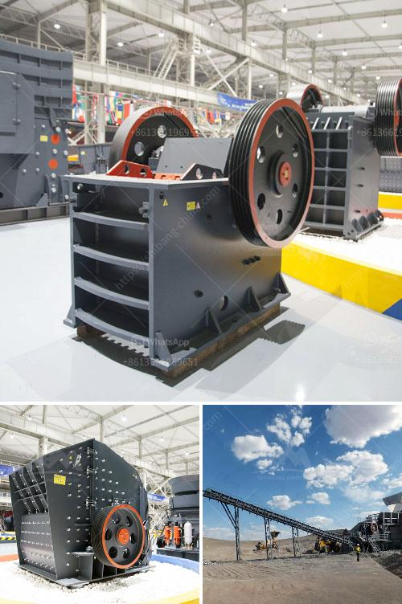

<h3>impact crusher 5tph for sale south africa</h3>
An Impact Crusher is a machine that uses striking as opposed to pressure to reduce the size of a material. Impact crushers are designated as a primary, secondary, tertiary, or quarternary rotor crusher depending on which processing stage the equipment is being utilized. The impact crusher market in South Africa is experiencing a high growth rate and is expected to continue growing into the future.

With its versatile applications, impact crushers are used for primary and secondary crushing of hard materials like limestone, dolomite, sandstone, graphite, blast furnace slag, coal, and various ores. They have a high reduction ratio, and are capable of producing a product size of a quarter-inch to minus 4 inches.

In South Africa, the impact crusher 5tph for sale is for quarrying and mining but also used in recycling applications. Impact crushers are a popular choice in the South African quarrying industry due to their low capital cost, versatility, and ability to operate in diverse conditions.

The impact crusher 5tph for sale in South Africa has been the most prominent product in the industry because of its excellent efficiency and low cost. Customers always rely on it because of its high capacity and low power consumption. However, the impact crusher 5tph for sale only suits medium and low hardness materials. It is not suitable for crushing high hardness stones such as basalt, granite, river pebbles, etc.

1. Versatility: The impact crusher 5tph for sale can be used as a primary, secondary, or tertiary crusher depending on the material's size and hardness. This flexibility helps to improve the overall efficiency of the crushing process.

2. High reduction ratio: The impact crusher 5tph for sale is designed to provide a high reduction ratio, allowing the operator to obtain a specific product size with minimal fines production. This makes it suitable for a variety of applications where the end product needs to meet specific quality requirements.

3. Easy maintenance: The impact crusher 5tph for sale is designed with a robust construction and easy-to-maintain components. This ensures easy access to the internal parts for regular inspection and maintenance, reducing downtime and improving overall operational efficiency.

4. Cost-effective operation: With its efficient design and low power consumption, the impact crusher 5tph for sale provides a cost-effective crushing solution. The reduced operating costs and high productivity make it an attractive choice for businesses looking to optimize their crushing operations.

In conclusion, the impact crusher 5tph for sale in South Africa offers a cost-effective and efficient crushing solution for various applications. Its versatility, high reduction ratio, and easy maintenance make it a reliable choice for crushing various materials in the quarrying and mining industry. As the demand for aggregates continues to grow in South Africa, the impact crusher 5tph for sale is expected to play a significant role in meeting these demands.
<h3>Contact us</h3><ul><li><strong>Whatsapp:&nbsp;<a href="https://wa.me/8613661969651">+8613661969651</a></strong></li><li><a href="https://swt.shibang-china.com/?git&amp;zhl&amp;impact crusher 5tph for sale south africa"><strong>Online Service(chat now)</strong></a></li></ul><h3>Related</h3><ul><li><a href='cement cement grinding ball mill.md'>cement cement grinding ball mill</a></li><li><a href='how much complete cost for iron ore crasher plants setup.md'>how much complete cost for iron ore crasher plants setup</a></li><li><a href='ballast crusher kenya.md'>ballast crusher kenya</a></li><li><a href='cement plant for sale intpd.md'>cement plant for sale intpd</a></li><li><a href='vertical roller mill manufacture in tamilnadu.md'>vertical roller mill manufacture in tamilnadu</a></li></ul>