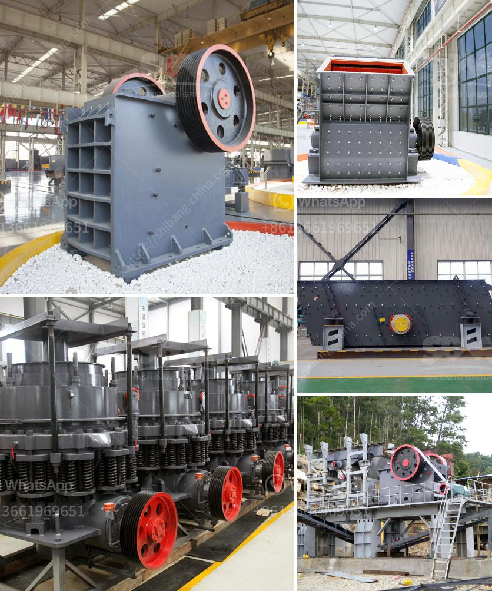

<h3>impact crusher dealer</h3>
Impact crushers have become a crucial component of the recycling industry in recent years. These crushers are capable of reducing large-size objects into smaller, more manageable pieces, making them ideal for recycling applications. A key player in this industry is the impact crusher dealer, who connects manufacturers with customers looking for reliable crushing equipment.

The role of an impact crusher dealer is multifaceted. They serve as intermediaries between manufacturers and customers, ensuring smooth transactions and providing expert guidance. These dealers possess an in-depth understanding of the various types of impact crushers available in the market, including horizontal shaft impactors and vertical shaft impactors, along with their capabilities and limitations.

One of the primary responsibilities of an impact crusher dealer is to match customers with the most suitable crusher for their specific needs. They consider factors such as the material to be crushed, desired output size, production capacity, and budget restrictions. By leveraging their expertise, impact crusher dealers enable customers to make informed purchasing decisions that align with their requirements.

Moreover, an impact crusher dealer often extends their support beyond the initial sale. They provide comprehensive aftersales services, including installation, maintenance, and repair. This ensures that the crusher operates optimally throughout its lifespan and minimizes downtime for the customer. The expertise and prompt assistance offered by a trusted impact crusher dealer build long-lasting relationships and create a loyal customer base.

In recent years, the recycling industry has witnessed significant growth, driven by sustainability efforts and environmental consciousness. As a result, the demand for impact crushers has surged. Impact crusher dealers play a pivotal role in meeting this demand by connecting manufacturers with customers and facilitating the adoption of recycling practices.

In conclusion, the impact crusher dealer has emerged as an essential link in the recycling industry. They bridge the gap between crusher manufacturers and customers, offering expertise, guidance, and comprehensive aftersales support. Their contribution facilitates the growth of the recycling industry, making a positive impact on sustainable practices and environmental conservation.
<h3>Contact us</h3><ul><li><strong>Whatsapp:&nbsp;<a href="https://wa.me/8613661969651">+8613661969651</a></strong></li><li><a href="https://swt.shibang-china.com/?git&amp;zhl&amp;impact crusher dealer"><strong>Online Service(chat now)</strong></a></li></ul><h3>Related</h3><ul><li><a href='sand crusher price.md'>sand crusher price</a></li><li><a href='iron ore beneficiation process in mexico.md'>iron ore beneficiation process in mexico</a></li><li><a href='crusher dimensions crusher conica.md'>crusher dimensions crusher conica</a></li><li><a href='crusher plant in jizan saudi arabia.md'>crusher plant in jizan saudi arabia</a></li><li><a href='gypsum crushing machine price.md'>gypsum crushing machine price</a></li></ul>