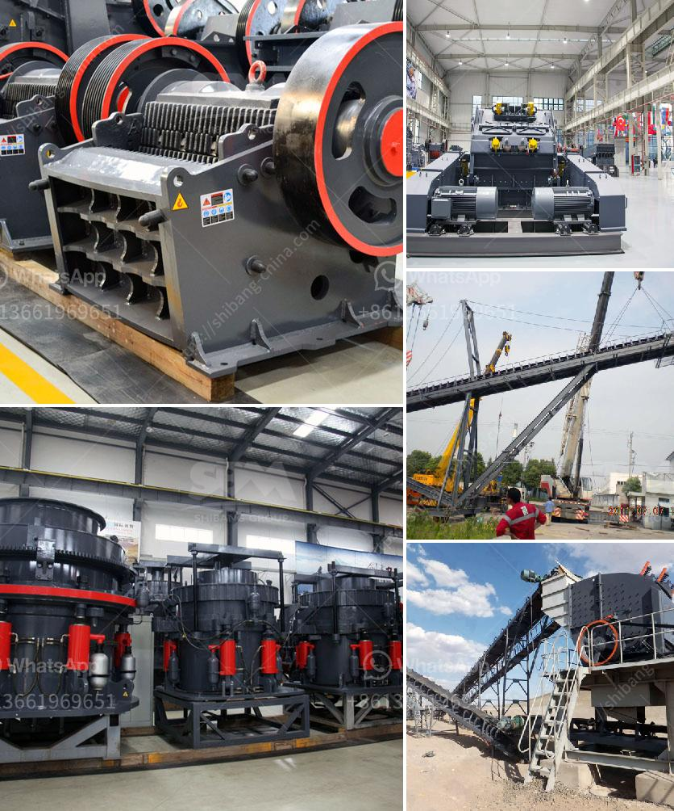

<h3>impact crusher for sale johannesburg</h3>
The bustling city of Johannesburg, also known as the "City of Gold," is a hub for various industries, including mining and construction. As such, it is no surprise that the demand for high-quality machinery, such as impact crushers, is on the rise.

An impact crusher is a heavy-duty machine that is designed to reduce the size of large rocks into smaller pieces or gravel. This crushing equipment utilizes the impact of quick, powerful blows to crush the material as it enters the crushing chamber, reducing the size and shape of the stones or rocks. This process helps to produce a more uniform product, making it suitable for various applications, including road construction, building materials, and mining projects.

For those in Johannesburg looking for an impact crusher for sale, there are various options available. Numerous reputable suppliers and dealers offer a wide range of impact crushers, ensuring that customers find the right equipment to meet their specific needs. These crushers come in different sizes and configurations, allowing users to choose the perfect machine for their project requirements.

What sets impact crushers apart from other crushing equipment is their ability to handle various types of materials. Whether it is concrete, asphalt, limestone, or other hard and abrasive materials, these machines can handle them all. The robust design and powerful impact force of these crushers make them ideal for crushing even the toughest materials. With the right impact crusher, businesses in Johannesburg can save time and money by efficiently processing materials on-site, reducing the need for transportation and additional machinery.

Moreover, purchasing an impact crusher for sale in Johannesburg provides numerous benefits. Firstly, it ensures that businesses have a reliable and high-performing machine that can withstand the demanding conditions of the industry. Additionally, buying locally not only supports the local economy but also allows customers to access professional advice, after-sales service, and spare parts easily.

In conclusion, if you are in the market for an impact crusher in Johannesburg, there are numerous options available. Investing in this invaluable equipment ensures that businesses in the mining and construction industries have the necessary tools to crush materials efficiently and effectively. Seek out reputable suppliers and dealers in the area to find the perfect impact crusher to suit your needs and take your operations to new heights.
<h3>Contact us</h3><ul><li><strong>Whatsapp:&nbsp;<a href="https://wa.me/8613661969651">+8613661969651</a></strong></li><li><a href="https://swt.shibang-china.com/?git&amp;zhl&amp;impact crusher for sale johannesburg"><strong>Online Service(chat now)</strong></a></li></ul><h3>Related</h3><ul><li><a href='used concrete crushers uk.md'>used concrete crushers uk</a></li><li><a href='design of coal screen.md'>design of coal screen</a></li><li><a href='cone crusher for sale in india.md'>cone crusher for sale in india</a></li><li><a href='aggregate machine traders.md'>aggregate machine traders</a></li><li><a href='trackmounted equipment.md'>track-mounted equipment</a></li></ul>