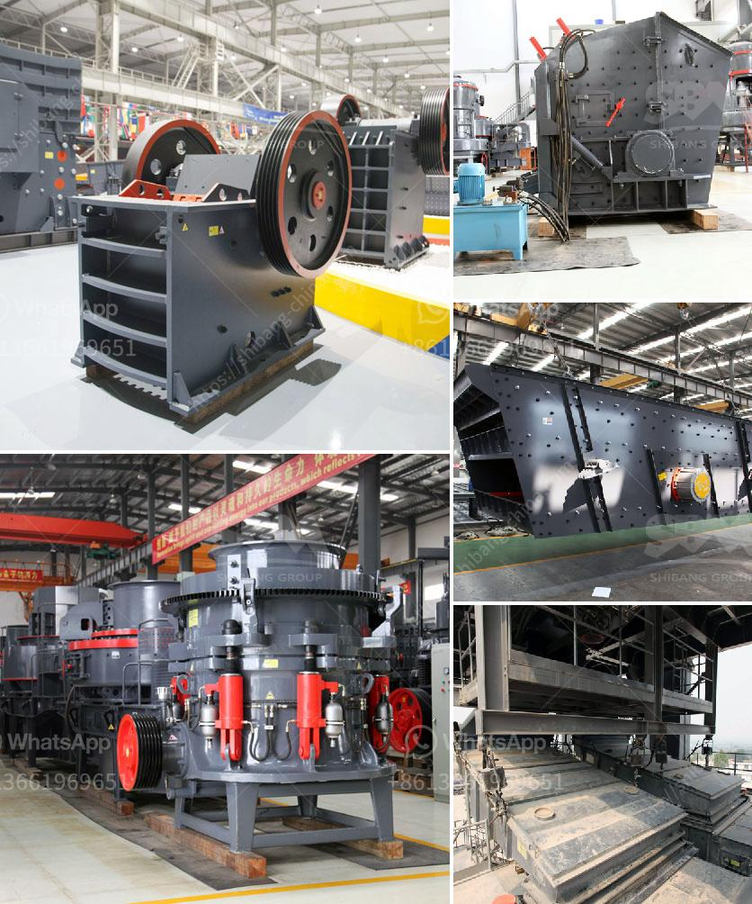

<h3>impact crusher machine supplier</h3>
The demand for construction and mining machinery is constantly increasing, and invariably, so is the need for efficient crushers. This is where an impact crusher machine supplier comes into play, offering a wide range of crushing solutions to meet diverse requirements.

An impact crusher is a machine that uses striking as opposed to pressure to reduce the size of a material. Impact crushers are used to crush a variety of materials, such as limestone, granite, coal, concrete, and other minerals. This further enhances their versatility and makes them ideal for various applications such as construction, mining, and recycling.

One crucial factor that determines the efficiency of an impact crusher is its supplier. A reputable and reliable supplier can offer not just a top-quality machine but also unmatched after-sales service, technical support, and customized solutions. It is pivotal to choose the right supplier capable of providing comprehensive solutions regarding maintenance, spare parts, and upgrades.

The market for impact crusher machines is highly competitive, with several suppliers vying for customers' attention. However, there are key qualities that distinguish a reliable supplier from the rest. Firstly, a reliable supplier has a deep understanding of the industry, possessing extensive knowledge about the functionality and applications of impact crushers. They can guide customers in selecting the best machine based on their specific requirements.

Furthermore, a reputable supplier will offer a wide range of impact crusher models, each designed to cater to different needs. These models may vary in terms of capacity, feed size, and power consumption, allowing customers to choose the most suitable option. A diverse range of models ensures that customers get the most productive and efficient solution for their unique crushing needs.

Apart from offering a wide range of models, a reliable supplier ensures that the impact crushers are equipped with advanced features and technologies. This includes features like adjustable discharge outlets, hydraulic adjustment systems, automatic oil lubrication, and robust rotor assemblies. These features not only enhance the machine's performance but also contribute to its longevity and ease of maintenance.

In addition to offering superior machines, a trustworthy supplier will also provide exceptional after-sales service, technical support, and timely spare parts availability. They will have a dedicated team of experts, ready to assist customers with any queries or concerns they may have. This ensures that customers have peace of mind and can rely on the supplier for all their crusher-related needs throughout the machine's lifecycle.

Collaborating with a reliable impact crusher machine supplier brings numerous advantages to customers. Firstly, it increases productivity by efficiently reducing the size of materials, thereby expediting construction and mining processes. Secondly, it ensures durability and minimizes machine downtime, leading to increased operational efficiency. Additionally, a reliable supplier helps businesses reduce overall costs by offering cost-effective solutions and minimizing maintenance and repair expenses.

In conclusion, an impact crusher machine supplier plays a significant role in providing efficient crushing solutions to meet the increasing demand for construction and mining machinery. By offering a wide range of models, advanced features, and exceptional after-sales service, a reliable supplier ensures customer satisfaction and contributes to their success. It is crucial to choose the right supplier who understands the industry and provides comprehensive support, thereby securing a long-lasting and fruitful partnership.
<h3>Contact us</h3><ul><li><strong>Whatsapp:&nbsp;<a href="https://wa.me/8613661969651">+8613661969651</a></strong></li><li><a href="https://swt.shibang-china.com/?git&amp;zhl&amp;impact crusher machine supplier"><strong>Online Service(chat now)</strong></a></li></ul><h3>Related</h3><ul><li><a href='mineral grinding mill.md'>mineral grinding mill</a></li><li><a href='stone crusher price in zambia.md'>stone crusher price in zambia</a></li><li><a href='gypsum powder production.md'>gypsum powder production</a></li><li><a href='stamp mill foot for sale.md'>stamp mill foot for sale</a></li><li><a href='bauxite processing crusher.md'>bauxite processing crusher</a></li></ul>